##############################################################################
Chapter Motor
##############################################################################

Project 10.1 Control Motor
**************************************

Now, we will use dedicated chip DRV8837 to control the motor.

Component List
======================================

+-------------------------+------------------------------+------------------------------------------------------+
| Control board x1        | USB cable x1                 | Motor  x1                                            |
|                         |                              |                                                      |
| |Chapter06_00|          | |Chapter06_01|               | |Chapter10_00|                                       |
+-------------------------+----------------+-------------+------------------------------------------------------+
| Jumper Wire x2                           |  9V Battery Connector (Batteries NOT Included) x1                  |
|                                          |                                                                    |
| |Chapter06_03|                           |   |Chapter10_01|                                                   |
+------------------------------------------+--------------------------------------------------------------------+
| Freenove Projects Board                                                                                       |
|                                                                                                               |
| |Chapter06_04|                                                                                                |
+---------------------------------------------------------------------------------------------------------------+

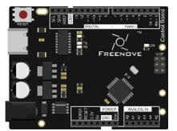
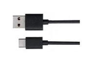
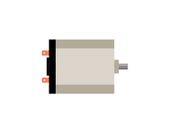

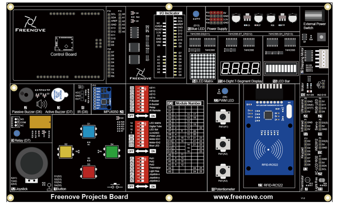

Component Knowledge
=====================================

DC Motor
-------------------------------------

A DC Motor is a device that converts electrical energy into mechanical energy. DC Motors consist of two major parts, a Stator and the Rotor. The stationary part of a DC Motor is the Stator and the part that Rotates is the Rotor. The Stator is usually part of the outer case of motor (if it is simply a pair of permanent magnets), and it has terminals to connect to the power if it is made up of electromagnet coils. Most Hobby DC Motors only use Permanent Magnets for the Stator Field. The Rotor is usually the shaft of motor with 3 or more electromagnets connected to a commutator where the brushes (via the terminals 1 & 2 below) supply electrical power, which can drive other mechanical devices. The diagram below shows a small DC Motor with two terminal pins.

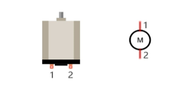

When a DC Motor is connected to a power supply, it will rotate in one direction. If you reverse the polarity of the power supply, the DC Motor will rotate in opposite direction. This is important to note.

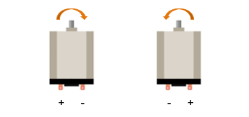

DRV8837
-------------------------------------

DRV8837 is a 2-channel motor driven IC chip. You can use it to drive a unidirectional DC motor with 2 ports or a bidirectional DC motor with 1 port.

.. list-table:: 
    :width: 100%
    :align: center
    :class: product-table

    *   -   |Chapter10_04|
        -   |Chapter10_05|

.. |Chapter10_05| image:: ../_static/imgs/10_Motor/Chapter10_05.png

Port description of DRV8837 module is as follows:

.. list-table:: 
    :width: 100%
    :align: center
    :class: product-table

    *   -   Pin name
        -   Pin number
        -   Description

    *   -   VM
        -   1
        -   Power supply for motor

    *   -   Out x
        -   2,3
        -   Output control chip: Determine the output state according to the In x input signal

    *   -   GND
        -   4
        -   Negative pole

    *   -   IN x
        -   5,6
        -   Input control signal

    *   -   EN
        -   5
        -   Chip enable signal, valid at high level

    *   -   VCC
        -   6
        -   3.3V or 5V logic power supply

For more details, please see datasheet.

When using DRV8837 to drive DC motor, there are usually two kinds of connection.

The following connection option uses one channel of the DRV8837, which can control motor speed through the PWM, However the motor then can only rotate in one direction.

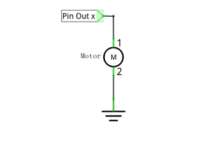

The following connection uses two channels of the DRV8837: one channel outputs the PWM wave, and the other channel connects to GND. Therefore, you can control the speed of the motor. When these two channel signals are exchanged, not only controls the speed of motor, but also can control the direction of the motor.

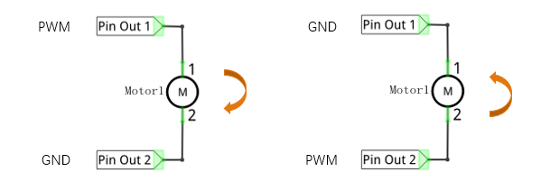

Circuit
====================

Use pin A1 of the control board to detect the voltage of rotary potentiometer; pin 9 and pin 10 to control the motor's rotation direction and speed.

+-------------------------+----------------------------------+
| Schematic diagram       | Hardware connection              |
|                         |                                  |
| |Chapter10_08|          | |Chapter10_09|                   |
+-------------------------+----------------------------------+
| Hardware connection                                        |
|                                                            |
| |Chapter10_10|                                             |
+------------------------------------------------------------+

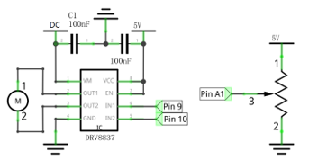
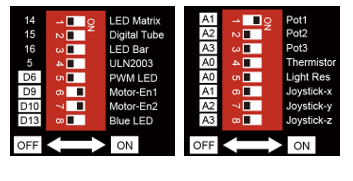
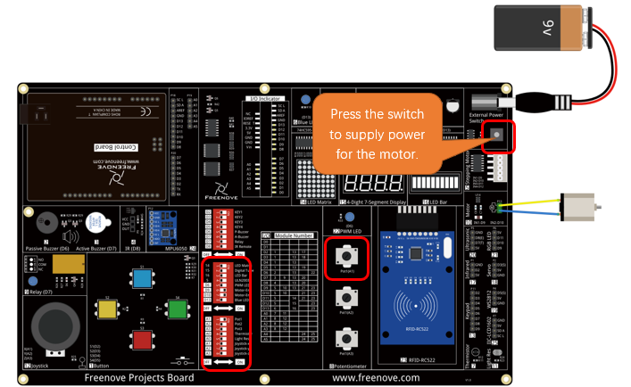

Sketch
========================

Control_Motor
------------------------

Now, write the code to control speed and rotation direction of motor through rotary potentiometer. When the potentiometer stays in the middle position, the motor speed is the minimum; When it deviates from the middle position, the speed will increase. Also, if the potentiometer deviates from the middle position of potentiometer clockwise or counterclockwise, the rotation direction of the motor is different.

.. literalinclude:: ../../../freenove_Kit/Sketches/Sketch_10.1_Control_Motor/Sketch_10.1_Control_Motor.ino
    :linenos: 
    :language: c
    :dedent:

In the code, we write a function to control the motor, and control the speed and direction through two parameters.

.. literalinclude:: ../../../freenove_Kit/Sketches/Sketch_10.1_Control_Motor/Sketch_10.1_Control_Motor.ino
    :linenos: 
    :language: c
    :dedent:
    :lines: 36-46

In the loop () function, detect the digital value of rotary potentiometer, and convert it into the motor speed and direction through calculation.

.. literalinclude:: ../../../freenove_Kit/Sketches/Sketch_10.1_Control_Motor/Sketch_10.1_Control_Motor.ino
    :linenos: 
    :language: c
    :dedent:
    :lines: 20-34

.. py:function:: abs(x)

    Calculates the absolute value of a number.

Verify and upload the code, rotate the shaft of rotary potentiometer, and then you can see the change of the motor speed and direction. 