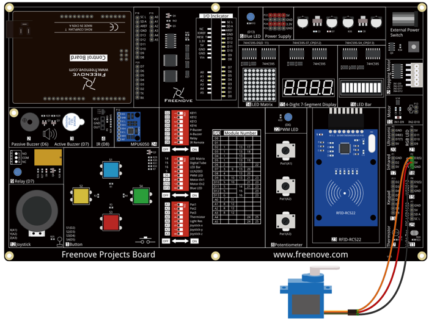

##############################################################################
Chapter Servo
##############################################################################

Earlier, we have used control board and L293D module to control the motor speed and direction. Now, we will use another motor, servo, which can rotate to a certain angle.

Project 11.1 Servo Sweep
***********************************

First, let's get the servo to rotate.

Component List
=====================================

+-------------------------+------------------------------+-------------------------------+
| Control board x1        | USB cable x1                 | Servo x1                      |
|                         |                              |                               |
| |Chapter06_00|          | |Chapter06_01|               | |Chapter11_00|                |
+-------------------------+------------------------------+-------------------------------+
| Freenove Projects Board                                                                |
|                                                                                        |
| |Chapter06_04|                                                                         |
+----------------------------------------------------------------------------------------+

.. |Chapter06_00| image:: ../_static/imgs/6_RGB_LED/Chapter06_00.png
.. |Chapter06_01| image:: ../_static/imgs/6_RGB_LED/Chapter06_01.png

.. |Chapter06_04| image:: ../_static/imgs/6_RGB_LED/Chapter06_04.png

Component Knowledge
================================

Servo
--------------------------------

Servo is a compact package which consists of a DC Motor, a set of reduction gears to provide torque, a sensor and control circuit board. Most Servos only have a 180-degree range of motion via their “horn”. Servos can output higher torque than a simple DC Motor alone and they are widely used to control motion in model cars, model airplanes, robots, etc. Servos have three wire leads which usually terminate to a male or female 3-pin plug. Two leads are for electric power: Positive (2-VCC, Red wire), Negative (3-GND, Brown wire), and the signal line (1-Signal, Orange wire) as represented in the Servo provided in your Kit.

We will use a 50Hz PWM signal with a duty cycle in a certain range to drive the Servo. The lasting time 0.5ms-2.5ms of PWM single cycle high level corresponds to the Servo angle 0 degrees - 180 degrees linearly. Part of the corresponding values are as follows:

.. list-table:: 
    :width: 100%
    :align: center
    :class: product-table

    *   -   High level time
        -   Servo angle

    *   -   0.5ms
        -   0 degree

    *   -   1ms
        -   45 degree

    *   -   1.5ms
        -   90 degree

    *   -   2ms
        -   135 degree

    *   -   2.5ms
        -   180 degree

When you change the servo signal, the servo will rotate to the designated position.

Circuit
===========================

Use pin 3 of the control board to drive the servo. 

Pay attention to the color of servo lead wire: VCC (red), GND (brown), and signal line (orange). The wrong connection can cause damage to servo. 

.. list-table:: 
    :width: 100%
    :align: center
    :class: product-table

    *   -   Schematic diagram
    *   -   |Chapter11_02|
    *   -   Hardware connection
    *   -   |Chapter11_03|

Sketch
===========================

Servo_Sweep
---------------------------

Now, write the code to control servo, making it sweep in the movement range continuously.

.. literalinclude:: ../../../freenove_Kit/Sketches/Sketch_11.1_Servo_Sweep/Sketch_11.1_Servo_Sweep.ino
    :linenos: 
    :language: c
    :dedent:

Servo uses the Servo library, like the following reference to Servo library:

.. literalinclude:: ../../../freenove_Kit/Sketches/Sketch_11.1_Servo_Sweep/Sketch_11.1_Servo_Sweep.ino
    :linenos: 
    :language: c
    :dedent:
    :lines: 8-8

Servo library provides the Servo class that controls it. Different from the previous Serial class, Servo class must be instantiated before used: 

.. literalinclude:: ../../../freenove_Kit/Sketches/Sketch_11.1_Servo_Sweep/Sketch_11.1_Servo_Sweep.ino
    :linenos: 
    :language: c
    :dedent:
    :lines: 10-10

The code above defines an object of Servo type, myservo.

.. py:function:: Servo Class

    Servo class must be instantiated when used, that is, an object of the Servo type must be defined, for example:
    
        Servo myservo;
    
    Most other boards can define 12 objects of Servo type, namely, they can control up to 12 servos.

    The function commonly used in the servo class is as follows: 
    
    **myservo.attach** (pin): Initialize the servo, the parameter is the port connected to servo signal line;
    
    **myservo.write** (angle): Control servo to rotate to the specified angle; parameter here is to specify the angle.

After defining the Servo object, you can reference functions, such as initializing the servo:

.. literalinclude:: ../../../freenove_Kit/Sketches/Sketch_11.1_Servo_Sweep/Sketch_11.1_Servo_Sweep.ino
    :linenos: 
    :language: c
    :dedent:
    :lines: 16-16

After initializing the servo, you can control the servo to rotate to a specific angle: 

.. literalinclude:: ../../../freenove_Kit/Sketches/Sketch_11.1_Servo_Sweep/Sketch_11.1_Servo_Sweep.ino
    :linenos: 
    :language: c
    :dedent:
    :lines: 22-22

In the loop() function, we use the loop to control the servo to rotate from 0 degrees to 180 degrees, and then from 180 degrees to 0 degrees, then repeat the cycle all the time.

Verify and upload the code, the servo starts to sweep continuously. 

Project 11.2 Control Servo with Potentiometer
******************************************************

In the previous section, we've made the servo sweep continuously. Now, we will use a potentiometer to control the servo’s angle.

Component List
=====================================

+-------------------------+------------------------------+-------------------------------+
| Control board x1        | USB cable x1                 | Servo x1                      |
|                         |                              |                               |
| |Chapter06_00|          | |Chapter06_01|               | |Chapter11_00|                |
+-------------------------+------------------------------+-------------------------------+
| Freenove Projects Board                                                                |
|                                                                                        |
| |Chapter06_04|                                                                         |
+----------------------------------------------------------------------------------------+

Circuit
====================================

Use pin A1 of the control board to detect the voltage of rotary potentiometer, and pin 3 to drive the servo.

+-------------------------+----------------------------------+
| Schematic diagram       | Hardware connection              |
|                         |                                  |
| |Chapter11_05|          | |Chapter11_06|                   |
+-------------------------+----------------------------------+
| Hardware connection                                        |
|                                                            |
| |Chapter11_07|                                             |
+------------------------------------------------------------+

Sketch
====================================

Control_Servo_by_Potentiometer
------------------------------------

Now, write the code to detect the voltage of rotary potentiometer, and control servo to rotate to a different angle accordingly. 

.. literalinclude:: ../../../freenove_Kit/Sketches/Sketch_11.2_Control_Servo_by_Potentiometer/Sketch_11.2_Control_Servo_by_Potentiometer.ino
    :linenos: 
    :language: c
    :dedent:

In the code, we obtain the ADC value of pin A1, and map it to the servo angle.

Verify and upload the code, turn the potentiometer shaft, then the servo will rotate to a corresponding angle.