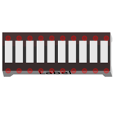

##############################################################################
Chapter LED Bar
##############################################################################

In the previous chapter, we have learned how to use some modules and sensors and display some information on the computer through serial port. Now let us learn some modules which can output images and text.

In this chapter, we will learn to drive the LED Bar with 74HC595 chip.

Project 15.1 LED Bar
***************************************

Firstly, let us learn how to use the 74HC595 chip, which is very helpful for us to control the LED matrix.

Component List
===============================================

+-------------------------+------------------------------+-------------------------------+
| Control board x1        | USB cable x1                 | LED Bar x1                    |
|                         |                              |                               |
| |Chapter06_00|          | |Chapter06_01|               | |Chapter15_00|                |
+-------------------------+------------------------------+-------------------------------+
| Freenove Projects Board                                                                |
|                                                                                        |
| |Chapter06_04|                                                                         |
+----------------------------------------------------------------------------------------+

.. |Chapter06_00| image:: ../_static/imgs/6_RGB_LED/Chapter06_00.png
.. |Chapter06_01| image:: ../_static/imgs/6_RGB_LED/Chapter06_01.png

.. |Chapter06_04| image:: ../_static/imgs/6_RGB_LED/Chapter06_04.png

Code Knowledge
===================================

Hexadecimal
-----------------------------------

The conversion between binary and decimal system has been mentioned before. When you write the code, the number is decimal by default. In the code, you need to add the prefix 0x for hexadecimal numbers, such as 0x01.

One Hexadecimal bit can present one number between 0-15. To facilitate writing, numbers greater than 9 are written into letters A-F (case-insensitive) such as 0x2A. The corresponding relationship is as follows:

.. list-table:: 
    :width: 100%
    :align: center
    :class: product-table

    *   -   Pin name
        -   0
        -   1
        -   2
        -   3
        -   4
        -   5
        -   6
        -   7
        -   8
        -   9
        -   10
        -   11
        -   12
        -   13
        -   14
        -   15

    *   -   Represent
        -   0
        -   1
        -   2
        -   3
        -   4
        -   5
        -   6
        -   7
        -   8
        -   9
        -   10
        -   11
        -   12
        -   13
        -   14
        -   15

Conversion between hexadecimal and decimal system is similar to the conversion between hexadecimal and binary, for example, the sixteen digit 0x12:

.. list-table:: 
    :width: 100%
    :align: center
    :class: product-table

    *   -   Sequence
        -   1
        -   0

    *   -   Number
        -   1
        -   2

When converting a hexadecimal number to decimal number, first, multiply the nth number of it by n power of 16, and then sum up all multiplicative results. Take 0x12 as an example:

    1 *16^1+2*16^0=18

When a decimal number is converted to hexadecimal number, the decimal number is divided by 16, so we will get quotient and remainder, and then the quotient obtained will be continuously divided by 16 until quotient is zero. Arrange all remainders from right to left in a line and wecomplete the conversion. For example:

The result is of the conversion 0x12.

When you write code, sometimes it is convenient to use hexadecimal, especially when involving bit operation, because 1 hexadecimal number can be expressed by 4 binary number (2^4=16). The corresponding relationship between 4 bit binary numbers and 1 hexadecimal number is shown as follows:

.. list-table:: 
    :width: 100%
    :align: center
    :class: product-table

    *   -   4 bit binary
        -   0000
        -   0001
        -   0010
        -   0011
        -   0100
        -   0101
        -   0110
        -   0111

    *   -   1 figure of hexadecimal
        -   0
        -   1
        -   2
        -   3
        -   4
        -   5
        -   6
        -   7

.. list-table:: 
    :width: 100%
    :align: center
    :class: product-table

    *   -   4 bit binary
        -   0000
        -   0001
        -   0010
        -   0011
        -   0100
        -   0101
        -   0110
        -   0111

    *   -   1 figure of hexadecimal
        -   0
        -   1
        -   2
        -   3
        -   4
        -   5
        -   6
        -   7

For example, binary 00010010 is corresponding to hexadecimal 0x12.

Component Knowledge
===========================================

74HC595
-------------------------------------------

A 74HC595 chip is used to convert serial data into parallel data. A 74HC595 chip can convert the serial data of one byte into 8 bits, and send its corresponding level to each of the 8 ports correspondingly. With this characteristic, the 74HC595 chip can be used to expand the IO ports of the control board. At least 3 ports on the control board are required to control the 8 ports of the 74HC595 chip.

The ports of 74HC595 are described as follows:

.. list-table:: 
    :width: 100%
    :align: center
    :class: product-table

    *   -   Pin name
        -   Pin number
        -   Description

    *   -   Q0-Q7
        -   15, 1-7   
        -   Parallel data output

    *   -   VCC
        -   16
        -   The positive electrode of power supply, the voltage is 2~6V
         
    *   -   GND
        -   8
        -   The negative electrode of power supply

    *   -   DS
        -   14
        -   Serial data Input

    *   -   OE
        -   13
        -   Enable output,

            When this pin is in high level, Q0-Q7 is in high resistance state

            When this pin is in low level, Q0-Q7 is in output mode

    *   -   ST_CP
        -   12
        -   Parallel update output: when its electrical level is rising, it will update the parallel data output.

    *   -   SH_CP
        -   11
        -   Serial shift clock: when its electrical level is rising, serial data input register will do a shift.

    *   -   MR
        -   10
        -   Remove shift register: When this pin is in low level, the content in shift register will be cleared .

    *   -   Q7'
        -   9
        -   Serial data output: it can be connected to more 74HC595 in series.

For more detail, please refer to the datasheet.

Circuit
========================================

Use pin 11, 12, 13 on the control board to control the 74HC595, and connect it to the 10 LEDs of LED bar graph.

+-------------------------+----------------------------------+
| Schematic diagram       | Hardware connection              |
|                         |                                  |
| |Chapter15_03|          | |Chapter15_04|                   |
+-------------------------+----------------------------------+
| Hardware connection                                        |
|                                                            |
| |Chapter15_05|                                             |
+------------------------------------------------------------+

Sketch
========================================

74HC595_LEDBAR
----------------------------------------

Now write code to control the 8 LEDs of LED bar graph through 74HC595.

.. literalinclude:: ../../../freenove_Kit/Sketches/Sketch_15.1_74HC595_LEDBAR/Sketch_15.1_74HC595_LEDBAR.ino
    :linenos: 
    :language: c
    :dedent:

In the code, we configure three pins to control 74HC595. And define a variable, through the variable bit to control the state of 10 LEDs. When the corresponding bit is 1, the LED lights up. If the variable is assigned a value of 0x01, which is the binary number 00000001, only one LED light will be on.

.. literalinclude:: ../../../freenove_Kit/Sketches/Sketch_15.1_74HC595_LEDBAR/Sketch_15.1_74HC595_LEDBAR.ino
    :linenos: 
    :language: c
    :dedent:
    :lines: 21-21

In each loop, the val is sent to 74HC595. The sending process is as follows:

.. literalinclude:: ../../../freenove_Kit/Sketches/Sketch_15.1_74HC595_LEDBAR/Sketch_15.1_74HC595_LEDBAR.ino
    :linenos: 
    :language: c
    :dedent:
    :lines: 37-43

The val will be shift 1 bit to left in each cycle, which makes the light-up LED of the 8 LEDs move one bit, that is, the current ON LED will be OFF, and its left one will light up.

.. literalinclude:: ../../../freenove_Kit/Sketches/Sketch_15.1_74HC595_LEDBAR/Sketch_15.1_74HC595_LEDBAR.ino
    :linenos: 
    :language: c
    :dedent:
    :lines: 26-26

.. py:function:: << operator

    "<<" is the left-shift operator, which can make all bits of 1 byte shift by several bits to the left (high) direction and add 0 to the right (low). For example, shift binary 00000001 by 1 bit to left:
        
        byte x = 1 << 1;

    .. image:: ../_static/imgs/15_LED_Bar/Chapter15_06.png
        :align: center

    The result of x is 2(binary 00000010).

    .. image:: ../_static/imgs/15_LED_Bar/Chapter15_07.png
        :align: center    
            
    There is another similar operator" >>". For example, shift binary 00000001 by 1 bit to right:
        
        byte x = 1 >> 1;

    .. image:: ../_static/imgs/15_LED_Bar/Chapter15_08.png
        :align: center    

    The result of x is 0(00000000)

    .. image:: ../_static/imgs/15_LED_Bar/Chapter15_09.png
        :align: center   
    
    X <<= 1 is equivalent to x = x << 1 and x >>= 1 is equivalent to x = x >> 1

Verify and upload the code, and then you will see the LED bar graph with the effect of flowing water.

