##############################################################################
Chapter 4-digit 7-segment Display
##############################################################################

Project 16.1 4-digit 7-segment Display
**************************************************

Now, try to use digit display that can display 4-digit numbers.

Component List
===============================================

+-------------------------+------------------------------+-------------------------------+
| Control board x1        | USB cable x1                 | Digital Tube x1               |
|                         |                              |                               |
| |Chapter06_00|          | |Chapter06_01|               | |Chapter16_00|                |
+-------------------------+------------------------------+-------------------------------+
| Freenove Projects Board                                                                |
|                                                                                        |
| |Chapter06_04|                                                                         |
+----------------------------------------------------------------------------------------+

.. |Chapter06_00| image:: ../_static/imgs/6_RGB_LED/Chapter06_00.png
.. |Chapter06_01| image:: ../_static/imgs/6_RGB_LED/Chapter06_01.png
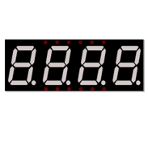
.. |Chapter06_04| image:: ../_static/imgs/6_RGB_LED/Chapter06_04.png

Component Knowledge
=============================================

4-digit 7-segment display
---------------------------------------------

A 4-digit 7-segment display integrates four 7-Segment Displays into one module, therefore, it can display more characters. All the LEDs contained have a Common Anode and individual Cathodes. Its internal structure and pin designation diagram is shown below:

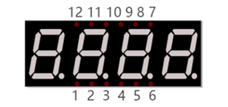

The internal electronic circuit is shown below, and all the eight LED cathode pins of each 1-digit 7-segment display are connected together.

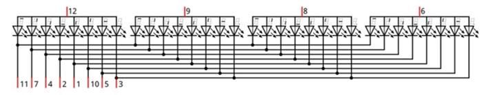

Display method of the 4-Digit 7-segment display is similar to that of the 1-Digit 7-segment display. The difference between them is that the 4-Digit displays each Digit is visible in turn, one by one and not together. We need to first send high level to the common end of the first Digit Display, and send low level to the remaining three common ends, and then send content to 8 LED cathode pins of the first Digit Display. At this time, the first 7-Segment Display will show visible content and the remaining three will be OFF.

Similarly, the second, third and fourth 7-Segment Displays will show visible content in turn by scanning the display. Although the four number characters are displayed in turn separately, this process is so fast that it is unperceivable to the naked eye. This is due to the principle of optical afterglow effect and the vision persistence effect in human sight. This is how we can see all 4 number characters at the same time. However, if each number character is displayed for a longer period, you will be able to see that the number characters are displayed separately. 

Circuit
=============================================

Control 74HC595 with pins 11, 12, 13 of the control board, and connect the 4-digit 7-segment display to the board.

+-------------------------+----------------------------------+
| Schematic diagram       | Hardware connection              |
|                         |                                  |
| |Chapter16_03|          | |Chapter16_04|                   |
+-------------------------+----------------------------------+
| Hardware connection                                        |
|                                                            |
| |Chapter16_05|                                             |
+------------------------------------------------------------+

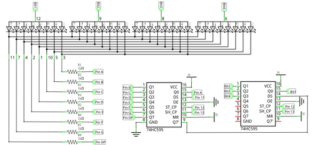
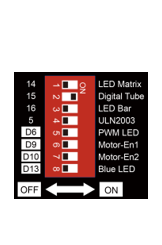
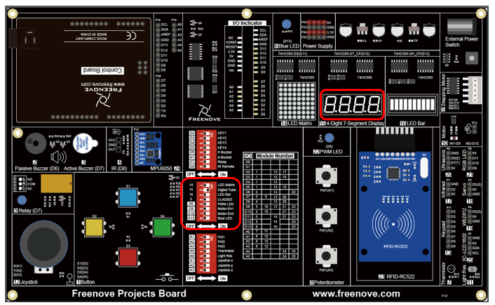

Sketch
================================================

Digital_Tube
---------------------------------------------

Now, write code to control 4-digit 7-segment display to display 4 numbers.

.. literalinclude:: ../../../freenove_Kit/Sketches/Sketch_16.1_Digital_Tube/Sketch_16.1_Digital_Tube.ino
    :linenos: 
    :language: c
    :dedent:

The 4-digit 7-segment display is a common-anode digital tube, whose code values from 0 to F are as follows:

.. literalinclude:: ../../../freenove_Kit/Sketches/Sketch_16.1_Digital_Tube/Sketch_16.1_Digital_Tube.ino
    :linenos: 
    :language: c
    :dedent:
    :lines: 12-13

Write a function to send the display bit data of the digital tube first, and then send its display content. The sending process is as follows

.. literalinclude:: ../../../freenove_Kit/Sketches/Sketch_16.1_Digital_Tube/Sketch_16.1_Digital_Tube.ino
    :linenos: 
    :language: c
    :dedent:
    :lines: 31-36

First, display "0" on the first digital tube for 5 milliseconds, and then display "1" on the second one, for 5 milliseconds, and then display "2" on the third one for 5 milliseconds, and finally, display "3" on the fourth digital tube for 5 milliseconds. Repeat this process 100 times.

When the digital tube is displaying, although the four number characters are displayed in turn separately, this process is so fast that it is unperceivable to the naked eye, so what we observer is that all the four number characters are displaying at the same time. Based on this, we can make it display any number we want.

If it is difficult for you to understand, you can modify delay(5) to delay(500) to slow down the process by 100 times.

.. literalinclude:: ../../../freenove_Kit/Sketches/Sketch_16.1_Digital_Tube/Sketch_16.1_Digital_Tube.ino
    :linenos: 
    :language: c
    :dedent:
    :lines: 23-28

Verify and upload the code, and then you will see number 0123 shown on 4 digit 7-segment display.

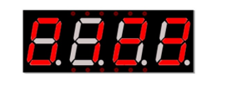

Project 16.2 4-digit 7-segment Display
******************************************************

Now, try to use digit display that can display 4-digit numbers.

Component List
===============================================

+-------------------------+------------------------------+-------------------------------+
| Control board x1        | USB cable x1                 | Digital Tube x1               |
|                         |                              |                               |
| |Chapter06_00|          | |Chapter06_01|               | |Chapter16_00|                |
+-------------------------+------------------------------+-------------------------------+
| Freenove Projects Board                                                                |
|                                                                                        |
| |Chapter06_04|                                                                         |
+----------------------------------------------------------------------------------------+

Circuit
================================================

Control 74HC595 with pins 11, 12, 13 of the control board, and connect the 4-digit 7-segment display to the board.

+-------------------------+----------------------------------+
| Schematic diagram       | Hardware connection              |
|                         |                                  |
| |Chapter15_07|          | |Chapter15_08|                   |
+-------------------------+----------------------------------+
| Hardware connection                                        |
|                                                            |
| |Chapter15_09|                                             |
+------------------------------------------------------------+

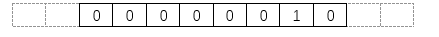
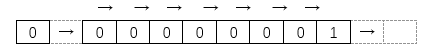
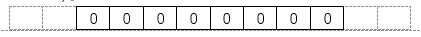

Sketch
===========================================

Digital_Tube
-------------------------------------------

Now, we use the digital tube to display counting.

.. literalinclude:: ../../../freenove_Kit/Sketches/Sketch_16.2_Digital_Tube/Sketch_16.2_Digital_Tube.ino
    :linenos: 
    :language: c
    :dedent:

Compile a function that converts the number to be displayed into the display data for each digital tube.

.. literalinclude:: ../../../freenove_Kit/Sketches/Sketch_16.2_Digital_Tube/Sketch_16.2_Digital_Tube.ino
    :linenos: 
    :language: c
    :dedent:
    :lines: 31-36

Compile and upload the code, and you can see the number on digital tube increases by one every approximately 1s

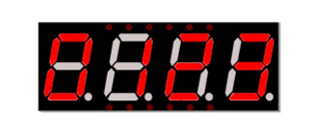