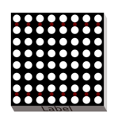
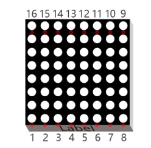
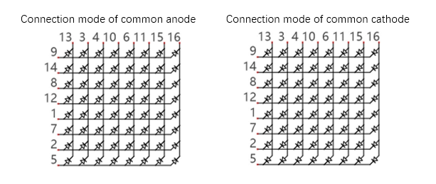
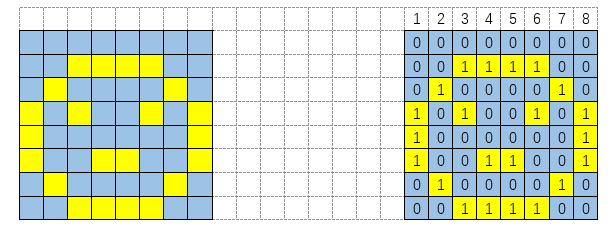
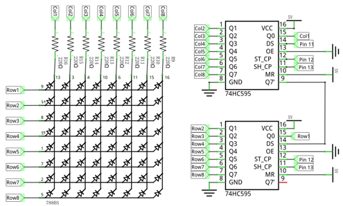
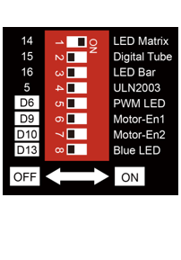
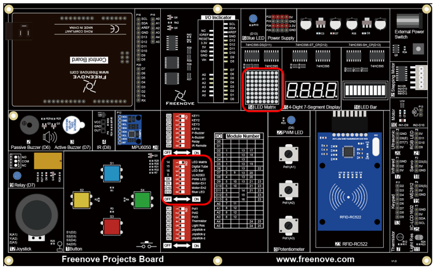

##############################################################################
Chapter LED Matrix
##############################################################################

In the previous section, we have used 74HC595 to control 8 LEDs of the LED bar graph. Now let's use 74HC595 to control LED matrix.

Component List
===========================================

+-------------------------+------------------------------+-------------------------------+
| Control board x1        | USB cable x1                 | Digital Tube x1               |
|                         |                              |                               |
| |Chapter06_00|          | |Chapter06_01|               | |Chapter17_00|                |
+-------------------------+------------------------------+-------------------------------+
| Freenove Projects Board                                                                |
|                                                                                        |
| |Chapter06_04|                                                                         |
+----------------------------------------------------------------------------------------+

.. |Chapter06_00| image:: ../_static/imgs/6_RGB_LED/Chapter06_00.png
.. |Chapter06_01| image:: ../_static/imgs/6_RGB_LED/Chapter06_01.png

.. |Chapter06_04| image:: ../_static/imgs/6_RGB_LED/Chapter06_04.png

Component Knowledge
============================================

LED matrix
--------------------------------------------

An LED Matrix is a rectangular display module that consists of a uniform grid of LEDs. The following is an 8X8 monochrome (one color) LED Matrix containing 64 LEDs (8 rows by 8 columns).

In order to facilitate the operation and reduce the number of ports required to drive this component, the Positive Poles of the LEDs in each row and Negative Poles of the LEDs in each column are respectively connected together inside the LED Matrix module, which is called a Common Anode. There is another arrangement type. Negative Poles of the LEDs in each row and the Positive Poles of the LEDs in each column are respectively connected together, which is called a Common Cathode.

The LED Matrix that we use in this project is a Common Anode LED Matrix.

Here is how a Common Anode LED Matrix works. First, choose 16 ports on RPI board to connect to the 16 ports of LED Matrix. Configure one port in columns for low level, which makes that column the selected port. Then configure the eight port in the row to display content in the selected column. Add a delay value and then select the next column that outputs the corresponding content. This kind of operation by column is called Scan. If you want to display the following image of a smiling face, you can display it in 8 columns, and each column is represented by one byte.

.. list-table:: 
    :width: 100%
    :align: center
    :class: product-table

    *   -   Column 
        -   Binary
        -   Hexadecimal

    *   -   1
        -   2
        -   Positive pole of power supply with a voltage of 5V

    *   -   GND
        -   2
        -   Negative pole of power supply

Scanning rows is another option to display on an LED Matrix (dot matrix grid). Whether scanning by row or column, 16 GPIO is required. In order to save GPIO ports of control board, two 74HC595 IC Chips are used in the circuit. 

Circuit
==============================================

Use pin 11, 12, 13 on control board to control the 74HC595. And connect 74HC595 to the 8 anode pins of LED Matrix, in the meanwhile, connect 8 digitals port on control board to the 8 cathode pins of LED Matrix.

+-------------------------+----------------------------------+
| Schematic diagram       | Hardware connection              |
|                         |                                  |
| |Chapter17_04|          | |Chapter17_05|                   |
+-------------------------+----------------------------------+
| Hardware connection                                        |
|                                                            |
| |Chapter17_06|                                             |
+------------------------------------------------------------+

Sketch
===========================

LED_Matrix
--------------------------------

Now write the code to drive LED dot matrix to display static and dynamic images. In fact, dynamic images are formed by continuous static images.

.. literalinclude:: ../../../freenove_Kit/Sketches/Sketch_17.1_LED_Matrix/Sketch_17.1_LED_Matrix.ino
    :linenos: 
    :language: c
    :dedent:

Use another array to define 8-column data of a smiling face.

.. literalinclude:: ../../../freenove_Kit/Sketches/Sketch_17.1_LED_Matrix/Sketch_17.1_LED_Matrix.ino
    :linenos: 
    :language: c
    :dedent:
    :lines: 13-15

Use another array to define some numbers and letters, and every eight elements of the array represent a dot matrix pattern data of a number or a letter.

.. literalinclude:: ../../../freenove_Kit/Sketches/Sketch_17.1_LED_Matrix/Sketch_17.1_LED_Matrix.ino
    :linenos: 
    :language: c
    :dedent:
    :lines: 18-36

.. py:function:: PROGMEM keyword

    Microprocessors generally have two storage areas, namely ROM and RAM. ROM is used to store code. And these stored data will not change with the execution of code until the code are uploaded. RAM is used to store data, for example, the variables we defined are stored here. The stored data will change in real time with the execution of the code. Generally, capacity of RAM is small. So we can use PROGMEM keyword to save the data that don't change in ROM.

Define a function to send the data of the LEDs that need to be lit for each row first, and then send the data of those for each column. Details are as follows.

.. literalinclude:: ../../../freenove_Kit/Sketches/Sketch_17.1_LED_Matrix/Sketch_17.1_LED_Matrix.ino
    :linenos: 
    :language: c
    :dedent:
    :lines: 70-75

.. py:function:: Bitwise logical operator

    There are many bitwise logical operators such as and (&), or (|), xor (^), negate (~). The result of exclusive or (^) is true only when its arguments differ (one is true, the other is false). 
    
    &, | and ^ is used to operate the corresponding bit of two numbers. For example:
        
        byte a = 1 & 2;
    
    "a" will be assigned to 0. The calculation procedure is as follows:

        1(00000001)
      & 2(00000010)
        0(00000000)

    Negate (~) is used to negate a number, for example:
        
        byte a = ~15;
    
    "a" will be assigned to 240. The calculation procedure is as follows:
    
    - 15(00001111)
    
      240(11110000)

In the loop () function, firstly, show the static smile pattern. Select one of the 8 columns circularly in turn to display each result. Repeat the process for 500 times, and then we can see a static smile pattern.

.. literalinclude:: ../../../freenove_Kit/Sketches/Sketch_17.1_LED_Matrix/Sketch_17.1_LED_Matrix.ino
    :linenos: 
    :language: c
    :dedent:
    :lines: 49-56

Then display the dynamic pattern of numbers and letters. We have defined space, 0-9, A-F, a total of 16 characters (136 columns) in an array, among which 8 adjacent rows of data form one frame. Shift one column once. There are 128 frames of image from the first frame (1-8) to the last frame (128-136 columns). Each frame image is displayed 10 times, then display the next frame. Repeat the process above, then we can see the pattern of scrolling numbers and letters.

.. literalinclude:: ../../../freenove_Kit/Sketches/Sketch_17.1_LED_Matrix/Sketch_17.1_LED_Matrix.ino
    :linenos: 
    :language: c
    :dedent:
    :lines: 58-67

Verify and upload the code, and LED Matrix begins to display the static smile pattern. A few seconds later, LED Matrix will display the scrolling number 0-9 and the letter A-F.