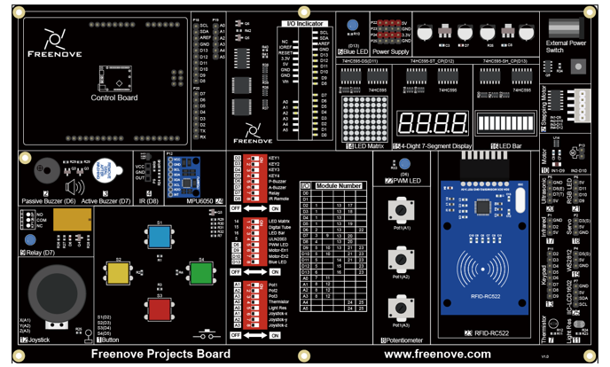

##############################################################################
Chapter I2C LCD1602
##############################################################################

Project 18.1 Display the String on I2C LCD1602
******************************************************

Firstly, use I2C LCD1602 to display some strings.

Component List
===========================

+-------------------------+------------------------------+-------------------------------+
| Control board x1        | USB cable x1                 | I2C-LCD1602 x1                |
|                         |                              |                               |
| |Chapter06_00|          | |Chapter06_01|               | |Chapter18_01|                |
+-------------------------+------------------------------+-------------------------------+
| Jumper Wire x4                                                                         |
|                                                                                        |
| |Chapter06_03|                                                                         |
+----------------------------------------------------------------------------------------+
| Freenove Projects Board                                                                |
|                                                                                        |
| |Chapter06_04|                                                                         |
+----------------------------------------------------------------------------------------+

.. |Chapter06_00| image:: ../_static/imgs/6_RGB_LED/Chapter06_00.png
.. |Chapter06_01| image:: ../_static/imgs/6_RGB_LED/Chapter06_01.png

.. |Chapter06_03| image:: ../_static/imgs/6_RGB_LED/Chapter06_03.png

Component Knowledge
=============================

I2C LCD1602
------------------------------

LCD1602 can display 2 lines of characters in 16 columns. It can display numbers, letters, symbols, ASCII code and so on.

I2C LCD1602 Display Screen integrates an I2C interface, which connects the serial-input & parallel-output module to the LCD1602 Display Screen. This allows us to use only 4 lines to the operate the LCD1602.

I2C (Inter-Integrated Circuit) has a two-wire serial communication mode, which can be used to connect a micro-controller and its peripheral equipment. Devices using I2C communications must be connected to the serial data line (SDA), and serial clock line (SCL) (called I2C bus). Each device has a unique address which can be used as a transmitter or receiver to communicate withdevices connected via the bus.

Next, let's try to use the I2C LCD1602 module to display characters.

Circuit
================================

The connection of control board and I2C LCD1602 is shown below. 

.. list-table:: 
    :width: 100%
    :align: center
    :class: product-table

    *   -   Schematic diagram
    *   -   |Chapter18_02|
    *   -   Hardware connection
    *   -   |Chapter18_03|
    *   -   |Chapter18_04|

.. |Chapter18_04| image:: ../_static/imgs/18_I2C_LCD1602/Chapter18_04.png

Sketch
=================================

Display_the_string_on_LCD1602
----------------------------------

Before writing code, we need to import the library needed.

Click “Add .ZIP Library...” and then find LiquidCrystal_I2C.zip in libraries folder (this folder is in the folder unzipped form the ZIP file we provided). This library can facilitate our operation of I2C LCD1602.

Now let's start to write code to use LCD1602 to display static characters and dynamic variables.

.. literalinclude:: ../../../freenove_Kit/Sketches/Sketch_18.1_Display_the_string_on_LCD1602/Sketch_18.1_Display_the_string_on_LCD1602.ino
    :linenos: 
    :language: c
    :dedent:

The following is the LiquidCrystal_I2C library used for controlling LCD:

.. literalinclude:: ../../../freenove_Kit/Sketches/Sketch_18.1_Display_the_string_on_LCD1602/Sketch_18.1_Display_the_string_on_LCD1602.ino
    :linenos: 
    :language: c
    :dedent:
    :lines: 7-7

LiquidCrystal_I2C library provides LiquidCrystal_I2C class that controls LCD1602. When we instantiate a LiquidCrystal_I2C object, we can input some parameters. And these parameters are the row/column numbers of the I2C addresses and screen that connect to LCD1602:

.. literalinclude:: ../../../freenove_Kit/Sketches/Sketch_18.1_Display_the_string_on_LCD1602/Sketch_18.1_Display_the_string_on_LCD1602.ino
    :linenos: 
    :language: c
    :dedent:
    :lines: 10-10

First, initialize the LCD and turn on LCD backlight.

.. literalinclude:: ../../../freenove_Kit/Sketches/Sketch_18.1_Display_the_string_on_LCD1602/Sketch_18.1_Display_the_string_on_LCD1602.ino
    :linenos: 
    :language: c
    :dedent:
    :lines: 13-17

And then print a string:

.. literalinclude:: ../../../freenove_Kit/Sketches/Sketch_18.1_Display_the_string_on_LCD1602/Sketch_18.1_Display_the_string_on_LCD1602.ino
    :linenos: 
    :language: c
    :dedent:
    :lines: 18-18

Print a changing number in the loop () function:

.. literalinclude:: ../../../freenove_Kit/Sketches/Sketch_18.1_Display_the_string_on_LCD1602/Sketch_18.1_Display_the_string_on_LCD1602.ino
    :linenos: 
    :language: c
    :dedent:
    :lines: 21-27

Before printing characters, we need to set the coordinate of the printed character, that is, in which line and which column:

.. literalinclude:: ../../../freenove_Kit/Sketches/Sketch_18.1_Display_the_string_on_LCD1602/Sketch_18.1_Display_the_string_on_LCD1602.ino
    :linenos: 
    :language: c
    :dedent:
    :lines: 23-23

.. py:function:: LiquidCrystal_I2C Class

    LiquidCrystal_I2C class can control common LCD screen. First, we need instantiate an object of LiquidCrystal_I2C type, for example:
    
    **LiquidCrystal_I2C lcd(0x27, 16, 2);**
    
    When an object is instantiated, a constructed function of the class is called a constructor. In the constructor function, we need to fill in the I2C address of the LCD module, as well as the number of columns and rows of the LCD module. The number of columns and rows can also be set in the lcd.begin ().
    
    The functions used in the LiquidCrystal_I2C class are as follows:
    
    **lcd.setCursor (col, row)**: set the coordinates of the to-be-printed character. The parameters are the numbers of columns and rows of the characters (start from 0, the number 0 represents first row or first line).
    
    **lcd.print (data)**: print characters. Characters will be printed on the coordinates set before. If you do not set the coordinates, the string will be printed behind the last printed character.

Verify and upload the code, then observe the LCD screen. If the display is not clear or there is no display, adjust the potentiometer on the back of I2C module to adjust the screen contrast until the character is clearly displayed on the LCD.

You can use the I2C LCD1602 to replace the serial port as a mobile screen when you print the data latter.

Project 18.2 I2C LCD1602 Clock
********************************************

In the previous chapter, we have used I2C LCD1602 to display some strings, and now let us use I2C LCD1602 to display the temperature sensor value.

Component List
===========================

+-------------------------+------------------------------+-------------------------------+
| Control board x1        | USB cable x1                 | I2C-LCD1602 x1                |
|                         |                              |                               |
| |Chapter06_00|          | |Chapter06_01|               | |Chapter18_01|                |
+-------------------------+------------------------------+-------------------------------+
| Jumper Wire x4                                                                         |
|                                                                                        |
| |Chapter06_03|                                                                         |
+----------------------------------------------------------------------------------------+
| Freenove Projects Board                                                                |
|                                                                                        |
| |Chapter06_04|                                                                         |
+----------------------------------------------------------------------------------------+

Code Knowledge
==============================

Timer
-----------------------------

A Timer can be set to produce an interrupt after a period of time. When a timer interrupt occurs, the processor will jump to the interrupt function to process the interrupt event. After completing the processing, it will return to the interrupted location to continue the program. If you don't close the timer, interrupt will occur at the intervals you set.

Circuit
==============================

The connection is shown below. Pin A0 is used to detect the voltage of thermistor. 

+-------------------------+----------------------------------+
| Schematic diagram       | Hardware connection              |
|                         |                                  |
| |Chapter18_07|          | |Chapter18_08|                   |
+-------------------------+----------------------------------+
| Hardware connection                                        |
|                                                            |
| |Chapter18_09|                                             |
+------------------------------------------------------------+
| |Chapter18_10|                                             |
+------------------------------------------------------------+

.. |Chapter18_08| image:: ../_static/imgs/18_I2C_LCD1602/Chapter18_08.png

Sketch
=============================

LCD1602_Clock
-----------------------------

Before writing code, we need to import the library needed.

Click “Add .ZIP Library...” and then find FlexiTimer2.zip in libraries folder (this folder is in the folder unzipped form the ZIP file we provided). This library can help manipulate the timer.

Now write code to make LCD1602 display the time and temperature, and the time can be modified through the serial port.

.. literalinclude:: ../../../freenove_Kit/Sketches/Sketch_18.2_LCD1602_Clock/Sketch_18.2_LCD1602_Clock.ino
    :linenos: 
    :language: c
    :dedent:

In the code, we define 3 variables to represent time: second, minute, hour.

.. literalinclude:: ../../../freenove_Kit/Sketches/Sketch_18.2_LCD1602_Clock/Sketch_18.2_LCD1602_Clock.ino
    :linenos: 
    :language: c
    :dedent:
    :lines: 15-15

Defines a timer with a cycle of 1000 millisecond (1 second). After each interruption, the number of seconds is increased by 1. When setting the timer, you need to define a function and pass the function name that works as a parameter to FlexiTimer2::set () function.

.. literalinclude:: ../../../freenove_Kit/Sketches/Sketch_18.2_LCD1602_Clock/Sketch_18.2_LCD1602_Clock.ino
    :linenos: 
    :language: c
    :dedent:
    :lines: 24-25

After each interruption, the number of seconds is increased by 1. 

.. literalinclude:: ../../../freenove_Kit/Sketches/Sketch_18.2_LCD1602_Clock/Sketch_18.2_LCD1602_Clock.ino
    :linenos: 
    :language: c
    :dedent:
    :lines: 59-62

.. py:function:: :: operator

    "::" is a scope operator. The function behind "::" is within the scope of that in front of ”::”. If we want to call the function defined in the FlexiTimer2 scope externally, we need to use the operator, which can be global scope operator, class scope operator or namespace scope operator. Here we use a namespace scope operator. Because functions of FlexiTimer2 library is defined in the namespace of FlexiTimer2,  we can find them in FlexiTimer2 library file.

In the loop () function, the information on the LCD display will be refreshed at set intervals.

.. code-block:: c

    void loop() {
        ......
        lcdDisplay();             // display temperature and time information on LCD
        delay(200);
    }

In the loop function, we need to control the second, minute, hour. When the second increases to 60, the minute increases by 1, and the second is reset to zero; when the minute increases to 60, the hour adds by 1, and the minute is reset to zero; when the hour increases to 24, reset it to zero.  

.. literalinclude:: ../../../freenove_Kit/Sketches/Sketch_18.2_LCD1602_Clock/Sketch_18.2_LCD1602_Clock.ino
    :linenos: 
    :language: c
    :dedent:
    :lines: 33-43

We define a function lcdDisplay () to refresh the information on LCD display. In this function, use two bit to display the hour, minute, second on the LCD. For example, the result of hour/ 10 is the tens digit, hour% 10 is the ones digit.

.. literalinclude:: ../../../freenove_Kit/Sketches/Sketch_18.2_LCD1602_Clock/Sketch_18.2_LCD1602_Clock.ino
    :linenos: 
    :language: c
    :dedent:
    :lines: 93-109

Serial port interrupt function is used to receive the data sent by computer to adjust the time, and return the data for confirmation.

.. literalinclude:: ../../../freenove_Kit/Sketches/Sketch_18.2_LCD1602_Clock/Sketch_18.2_LCD1602_Clock.ino
    :linenos: 
    :language: c
    :dedent:
    :lines: 64-92

We also define a function that displays a scrolling string as the control board started.

.. literalinclude:: ../../../freenove_Kit/Sketches/Sketch_18.2_LCD1602_Clock/Sketch_18.2_LCD1602_Clock.ino
    :linenos: 
    :language: c
    :dedent:
    :lines: 48-58

Verify and upload the code. The LCD screen will display a scrolling string first, and then displays the temperature and time. We can open Serial Monitor and enter time in the sending area, then click the Send button to set the time.

