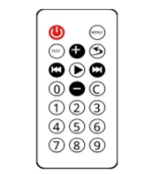
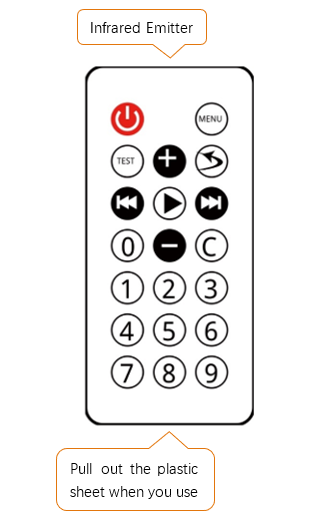
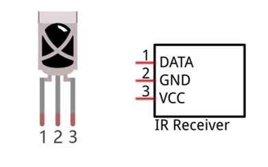
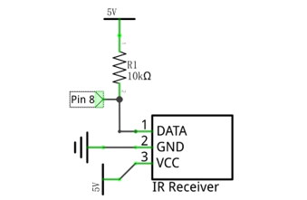
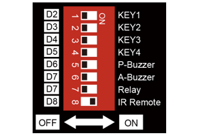
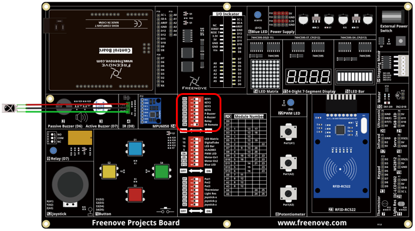
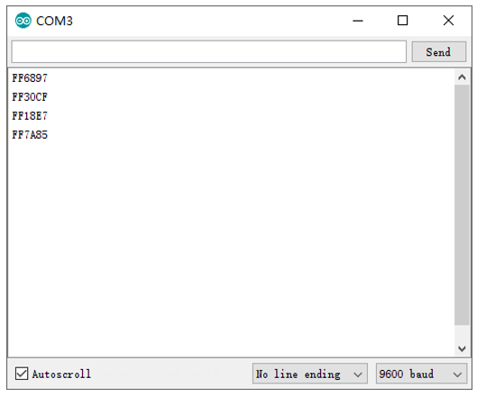
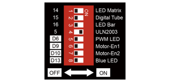
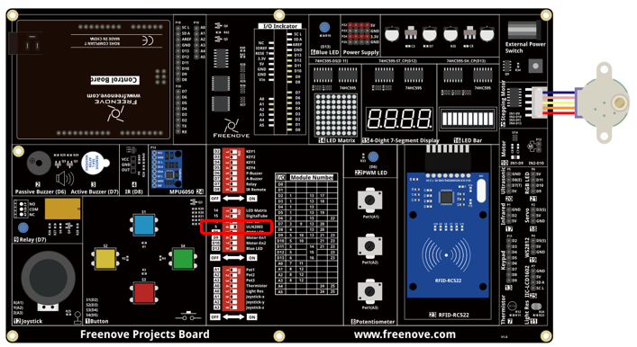

##############################################################################
Chapter Infrared Remote
##############################################################################

In this chapter, we'll learn how to use an infrared remote control, and control a LED.

Project 21.1 Infrared Remote Control
*******************************************

First, we need to understand how infrared remote control works, and then get the command sent from infrared remote control.

+-------------------------+----------------+----------------+------------------+
| Control board x1        | USB cable x1   | Infrared       | Infrared remote  |
|                         |                |                |                  |
|                         |                | receiver x1    | control x1       |
|                         |                |                |                  |
| |Chapter06_00|          | |Chapter06_01| | |Chapter21_00| |  |Chapter21_01|  |
+-------------------------+----------------+----------------+------------------+
| Freenove Projects Board                                                      |
|                                                                              |
| |Chapter06_04|                                                               |
+------------------------------------------------------------------------------+

.. |Chapter06_00| image:: ../_static/imgs/6_RGB_LED/Chapter06_00.png
.. |Chapter06_01| image:: ../_static/imgs/6_RGB_LED/Chapter06_01.png
.. |Chapter06_04| image:: ../_static/imgs/6_RGB_LED/Chapter06_04.png

Component Knowledge
==================================

Infrared remote
-----------------------------------

An Infrared(IR) remote control is a device with a certain number of buttons. Pressing down different buttons will make the infrared emitting tube, which is located on the front of the remote control, send infrared signals with different encoding. Infrared remote control technology is widely used in household appliances, such as TV, air conditioning, etc. Thus, it makes it possible for you to switch TV programs and adjust the temperature of the air conditioner that are far from you. The remote control we use is shown below:

Infrared receiver
--------------------------------------

Infrared(IR) receiver is a component which can receive the infrared light, so we can use it to detect the signal emitted by the infrared remote control. DATA pin here outputs the received infrared signal.

Circuit
==================================

Use pin 8 on the control board to connect IR receiver.

+-------------------------+------------------------------------------------------------------------+
| Schematic diagram       | Hardware connection                                                    |
|                         |                                                                        |
| |Chapter21_04|          | |Chapter21_06|                                                         |
+-------------------------+------------------------------------------------------------------------+
| Hardware connection                                                                              |
|                                                                                                  |
| |Chapter21_07|                                                                                   |
|                                                                                                  |
| Connect the infrared receiver to the IR interface on the control board.                          |
|                                                                                                  |
| Note: the head of the receiver should orient to the right.                                       |
+--------------------------------------------------------------------------------------------------+

Sketch
=================================

Infrared_Remote_Control
--------------------------------------

Before writing code, we need to import the library needed.

Click “Add .ZIP Library...” and then find IRremote.zip in libraries folder (this folder is in the folder unzipped from the ZIP file we provided). This library makes it easy to control IR receiver.

Now, write code to get the command sent from IR remote control, and send it to the serial port.

.. literalinclude:: ../../../freenove_Kit/Sketches/Sketch_20.1_Get_Input_Characters/Sketch_20.1_Get_Input_Characters.ino
    :linenos: 
    :language: c
    :dedent:

We use the IRrecv class provided by the IRremote library to control IR receiver in this code. As shown below, instantiate one IRrecv object, and the parameter represents the pin connected to the IR receiver.

.. literalinclude:: ../../../freenove_Kit/Sketches/Sketch_20.1_Get_Input_Characters/Sketch_20.1_Get_Input_Characters.ino
    :linenos: 
    :language: c
    :dedent:
    :lines: 11-11

decode_results class provided by the IRremote library is used to save the results of IR control decoding.

.. literalinclude:: ../../../freenove_Kit/Sketches/Sketch_20.1_Get_Input_Characters/Sketch_20.1_Get_Input_Characters.ino
    :linenos: 
    :language: c
    :dedent:
    :lines: 12-12

In the loop() function, decode the received signal, and sent it to computer through the serial port.

.. literalinclude:: ../../../freenove_Kit/Sketches/Sketch_20.1_Get_Input_Characters/Sketch_20.1_Get_Input_Characters.ino
    :linenos: 
    :language: c
    :dedent:
    :lines: 20-26

Verify and upload the code, open the Serial Monitor, and press the IR control button, and then you can see the corresponding code being printed out.

Project 21.2 Control LED through Infrared Remote
*********************************************************

Now, let us try to control anLED through infrared remote.

+-------------------------+----------------+----------------+------------------+
| Control board x1        | USB cable x1   | Infrared       | Infrared remote  |
|                         |                |                |                  |
|                         |                | receiver x1    | control x1       |
|                         |                |                |                  |
| |Chapter06_00|          | |Chapter06_01| | |Chapter21_00| |  |Chapter21_01|  |
+-------------------------+----------------+----------------+------------------+
| Freenove Projects Board                                                      |
|                                                                              |
| |Chapter06_04|                                                               |
+------------------------------------------------------------------------------+

Circuit
==========================================================

Connect pin 12 on the control board to IR receiver to simulate a desk lamp. And drive buzzer through pin 13, drive LED through pin 5. 

+-------------------------+----------------------------------+
| Schematic diagram       | Hardware connection              |
|                         |                                  |
| |Chapter19_04|          | |Chapter19_05|                   |
+-------------------------+----------------------------------+
| Hardware connection                                        |
|                                                            |
| |Chapter19_06|                                             |
+------------------------------------------------------------+

.. |Chapter19_04| image:: ../_static/imgs/19_Stepper_Motor/Chapter19_04.png

Sketch
====================================

Control_LED_through_Infrared_Remote
-------------------------------------

Now, write code to get the commands sent from IR remote, and control the LED light on/off or emit light with different brightness, and control the buzzer to generate a confirmation sound when it receives the command.

.. literalinclude:: ../../../freenove_Kit/Sketches/Sketch_21.2_Control_LED_through_Infrared_Remote/Sketch_21.2_Control_LED_through_Infrared_Remote.ino
    :linenos: 
    :language: c
    :dedent:

Based on the last section, we add some new functions: control LED and buzzer.

We define a function to handle the received commands. When this function is executed, make the buzzer beep first, then output PWM signals with different duty cycle to the pin connected to LED according to the receiving commands 

.. literalinclude:: ../../../freenove_Kit/Sketches/Sketch_21.2_Control_LED_through_Infrared_Remote/Sketch_21.2_Control_LED_through_Infrared_Remote.ino
    :linenos: 
    :language: c
    :dedent:
    :lines: 33-53

Each time when the command is received, the function above will be called in the loop() function.

.. literalinclude:: ../../../freenove_Kit/Sketches/Sketch_21.2_Control_LED_through_Infrared_Remote/Sketch_21.2_Control_LED_through_Infrared_Remote.ino
    :linenos: 
    :language: c
    :dedent:
    :lines: 25-31

Verify and upload the code, press the button '0', '1', '2', '3' on IR remote, and then you can see LED emit light with different brightness, and the buzzer will start beeping when it receives the signal.