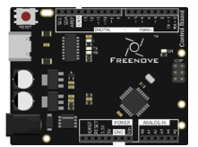

##############################################################################
Chapter Ultrasonic Ranging
##############################################################################

In this chapter, we learn a module that uses ultrasonic to measure distance, HC-SR04 ultrasonic ranging module.

Project 23 Ultrasonic Ranging 
*********************************************

In this project, we use ultrasonic ranging module to measure distance, and print out the data in the serial port.

Component List
============================================

+-------------------------+------------------------------+-------------------------------+
| Control board x1        | USB cable x1                 | Ultrasonic module x1          |
|                         |                              |                               |
| |Chapter06_00|          | |Chapter06_01|               | |Chapter23_00|                |
+-------------------------+------------------------------+-------------------------------+
| Jumper Wire x4                                                                         |
|                                                                                        |
| |Chapter06_03|                                                                         |
+----------------------------------------------------------------------------------------+
| Freenove Projects Board                                                                |
|                                                                                        |
| |Chapter06_04|                                                                         |
+----------------------------------------------------------------------------------------+

.. |Chapter06_01| image:: ../_static/imgs/6_RGB_LED/Chapter06_01.png

.. |Chapter06_03| image:: ../_static/imgs/6_RGB_LED/Chapter06_03.png
.. |Chapter06_04| image:: ../_static/imgs/6_RGB_LED/Chapter06_04.png

Component Knowledge
==========================================

Ultrasonic ranging module
------------------------------------------

The HC-SR04 Ultrasonic Ranging Module integrates both an ultrasonic transmitter and a receiver. The transmitter is used to convert electrical signals (electrical energy) into high frequency (beyond human hearing) sound waves (mechanical energy) and the function of the receiver is opposite of this. The picture and the diagram of the HC SR04 Ultrasonic Ranging Module are shown below:

The Ultrasonic Ranging Module uses the principle that ultrasonic waves will reflect when they encounter any obstacles. This is possible by counting the time interval between when the ultrasonic wave is transmitted to when the ultrasonic wave reflects back after encountering an obstacle. Time interval counting will end after an ultrasonic wave is received, and the time difference (delta) is the total time of the ultrasonic wave’s journey from being transmitted to being received. Because the speed of sound in air is a constant, and is about v=340m/s, we can calculate the distance between the Ultrasonic Ranging Module and the obstacle: s=vt/2.

Pin description:

.. list-table:: 
    :width: 100%
    :align: center
    :class: product-table

    *   -   Pin name
        -   Pin number
        -   Description

    *   -   Vcc
        -   1
        -   Positive electrode of power supply, the voltage is 5V

    *   -   Trig
        -   2
        -   Triger pin

    *   -   Echo
        -   3
        -   Echo pin

    *   -   Gnd
        -   4
        -   Negative electrode of power supply

Instructions for use: output a high-level pulse in Trig pin lasting for least 10uS, the module begins to transmit ultrasonic waves. At the same time, the Echo pin is pulled up. When the module receives the returned ultrasonic waves from encountering an obstacle, the Echo pin will be pulled down. The duration of high level in the Echo pin is the total time of the ultrasonic wave from transmitting to receiving, s=vt/2. This is done constantly.

Circuit
==================================

The connection of the control board and HC-SR04 is shown below.

.. list-table:: 
    :width: 100%
    :align: center
    :class: product-table

    *   -   Schematic diagram
    *   -   |Chapter23_03|
    *   -   Hardware connection
    *   -   |Chapter23_04|

Sketch
==================================

Ultrasonic_Ranging
----------------------------------

First, we use the HC-SR04 communication protocol to operate the module, get the range of time, and calculate the distance.

.. literalinclude:: ../../../freenove_Kit/Sketches/Sketch_23.1_Ultrasonic_Ranging/Sketch_23.1_Ultrasonic_Ranging.ino
    :linenos: 
    :language: c
    :dedent:

First, define the pins and the maximum measurement distance.

.. literalinclude:: ../../../freenove_Kit/Sketches/Sketch_23.1_Ultrasonic_Ranging/Sketch_23.1_Ultrasonic_Ranging.ino
    :linenos: 
    :language: c
    :dedent:
    :lines: 8-10

If the module does not return high level, we cannot wait for this forever. So we need to calculate the the time period for the maximum distance, that is, time Out. timeOut= 2*MAX_DISTANCE/100/340*1000000. The result of the constant part in this formula is approximately equal to 58.8. 

.. literalinclude:: ../../../freenove_Kit/Sketches/Sketch_23.1_Ultrasonic_Ranging/Sketch_23.1_Ultrasonic_Ranging.ino
    :linenos: 
    :language: c
    :dedent:
    :lines: 12-12

Then, in the setup (), set the pin to input or output, and set the serial port. In the loop(), we continue to use serial to print the value of subfunction getSonar (), which is used to return the measured distance of the HC_SR04. Make trigPin output a high level lasting for at least 10μs, according to the communication protocol.

.. literalinclude:: ../../../freenove_Kit/Sketches/Sketch_23.1_Ultrasonic_Ranging/Sketch_23.1_Ultrasonic_Ranging.ino
    :linenos: 
    :language: c
    :dedent:
    :lines: 31-33

And then the echoPin of HC_SR04 will output a pulse. Time of the pulse is the total time of ultrasonic from transmitting to receiving. We use the pulseIn () function to return the time, and set the timeout.

.. literalinclude:: ../../../freenove_Kit/Sketches/Sketch_23.1_Ultrasonic_Ranging/Sketch_23.1_Ultrasonic_Ranging.ino
    :linenos: 
    :language: c
    :dedent:
    :lines: 34-34

Calculate the distance according to the time and return the value.

.. literalinclude:: ../../../freenove_Kit/Sketches/Sketch_23.1_Ultrasonic_Ranging/Sketch_23.1_Ultrasonic_Ranging.ino
    :linenos: 
    :language: c
    :dedent:
    :lines: 35-36

Finally, the code above will be called in the loop ().

.. py:function:: pulseIn(pin, value) / pulseIn(pin, value, timeout)

    Return the length of the pulse (in microseconds) or 0 if no pulse is completed before the timeout (unsigned long).

Verify and upload the code to the control board, open the serial port monitoring window, turn the HC-SR04 probe towards the object plane, and observe the data in the serial port monitoring window.

Ultrasonic_Ranging
-------------------------------

Before writing code, we need to import the library needed.

Click “Add .ZIP Library...” and then find **NewPing.zip** in libraries folder (this folder is in the folder unzipped form the ZIP file we provided). This library makes it easy to obtain the measuring distance.

.. literalinclude:: ../../../freenove_Kit/Sketches/Sketch_23.2_Ultrasonic_Ranging/Sketch_23.2_Ultrasonic_Ranging.ino
    :linenos: 
    :language: c
    :dedent:

First, include the header file of library, and then define the HC SR04 pin and the maximum measurement distance. And then write these parameters when we define the NewPing class objects.

.. literalinclude:: ../../../freenove_Kit/Sketches/Sketch_23.2_Ultrasonic_Ranging/Sketch_23.2_Ultrasonic_Ranging.ino
    :linenos: 
    :language: c
    :dedent:
    :lines: 8-11

And then, in the loop (), use sonar.ping_cm () to obtain the  ultrasonic module detection distance with unit of centimeter. And print the distance out. When the distance exceeds range of 2cm~200cm, the printed data is zero.

.. py:function:: NewPing Class

    NewPing class can be used for SR04, SRF05, SRF06 and other sensors. An object that needs to be instantiated when the class is used. The three parameters of the constructor function are: trigger pin, echo pin and maximum measurement distance.
    
    NewPing sonar(trigger_pin, echo_pin [, max_cm_distance])
    
    Some member function:
    
    **sonar.ping** () - Send a ping and get the echo time (in microseconds) as a result. 
    
    **sonar.ping_in** () - Send a ping and get the distance in whole inches.
    
    **sonar.ping_cm** () - Send a ping and get the distance in whole centimeters.
    
    For more details, please refer to the NewPing.h in the NewPing library.

Verify and upload the code to control board and open the Serial Monitor. When the ultrasonic probe aims at a flat object, the distance between the two can be measured.

