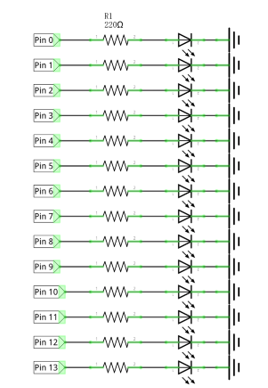
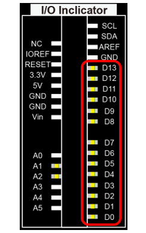
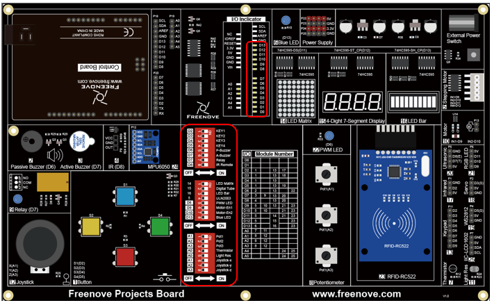

##############################################################################
Chapter Flowing LED
##############################################################################

We have learned previously how to control 1 LED through Sketch on the control board and learned some basic knowledge of programming. Now let us try to control 14 LEDs and learn how to simplify the code.

Project 2.1 Flowing LED Display
*********************************************

Let us use control board to control 14 LEDs.

Component List
==============================================

+-------------------------+----------------+
| Control board x1        | USB cable x1   |
|                         |                |
| |Chapter01_00|          | |Chapter01_01| |
+-------------------------+----------------+
| Freenove Projects Board                  |
|                                          |
| |Chapter01_02|                           |
+------------------------------------------+

.. |Chapter01_00| image:: ../_static/imgs/1_LED_Blink/Chapter01_00.png
.. |Chapter01_01| image:: ../_static/imgs/1_LED_Blink/Chapter01_01.png
.. |Chapter01_02| image:: ../_static/imgs/1_LED_Blink/Chapter01_02.png

Code Knowledge
================================

This section will introduce new code knowledge.

Array
-----------------------

An array is used to record a set of variables. An array is defined as below:

.. code-block:: c
    
    int a[10];

"int" is the type of the array and "10" represents the amount of elements of the array. This array can store 10 int types of elements as below.

.. code-block:: c
    
    int a[10] = {0, 1, 2, 3, 4, 5, 6, 7, 8, 9};

Or there is another form that the number of elements is the size of the array:

.. code-block:: c
    
    int a[] = {0, 1, 2, 3, 4, 5, 6, 7, 8, 9};

We can reference elements of an array as below：

.. code-block:: c
    
    int i, j;
    i = a[0];
    j = a[1];
    a[0] = 0;

Among them, "[]" is the array index, with a[0] as the first elements in the array.

For example, now we define an array b[] below:

.. code-block:: c
    
    int b[] = {5, 6, 7, 8};

The value of each element in array b[] is as follows:

.. list-table:: 
    :width: 80%
    :align: center
    :class: product-table

    *   -   b[0]
        -   b[1]
        -   b[2]
        -   b[3]

    *   -   5
        -   6
        -   7
        -   8   

This is just the use of one-dimensional array. And there are two-dimensional arrays, three-dimensional arrays, and multi-dimensional arrays. Readers interested of this part can develop your own learning.

Loop
-----------------------

The loop statement is used to perform repetitive work such as the initialization to all the elements of an array.

.. code-block:: c
    
    while(expression)
        functionX();

When there is more than one statement to be executed, the form is as follows:

.. code-block:: c
    
    while(expression){
        functionX();
        functionY();
    }

The first step of the execution is judging the expression inside "()". If the result is false, the statements inside "{}" will not be executed; if result is true, the statements will be executed.

.. code-block:: c
    
    int i = 0;
    while (i < 2)
        i = i + 1;
    i = 5;

First time: i<2, i=0 is tenable, execute i=i+1, then i=1;

Second time: i<2, i=1 is tenable, execute i=i+1, then i=2;

Third time: i<2, i=2 is not tenable, execution of loop statements is completed. Statement i=5 will be executed next. 

"do while" and "while" is similar. The difference is that the loop statements of "do while" is executed before judging expression. The result of the judgment will decide whether or not to go on the next execution:

.. code-block:: c
    
    do {
        functionX();
    } while (expression);

"for" is another loop statement, and its form is as follows:

.. code-block:: c
    
    for (expression1; expression2; expression 3)
        functionX();

When there is more than one statement to be executed, the form is as follows:

.. code-block:: c
    
    for (expression 1; expression 2; expression 3) {
        functionX();
        functionY();
    }

Expression 1 is generally used to initialize variables; expression 2 is a judgement which is used to decide whether or not to execute loop statements; the expression 3 is generally used to change the value of variables.

For example:

.. code-block:: c
    
    int i = 0, j = 0;
    for (i = 0; i < 2; i++)
        j++;
    i = 5;

First time: i=0, i<2 is tenable, execute j++, and execute i++, then i=1, j=1;

Second time: i=1, i<2 is tenable, execute j++, and execute i++, then i=2, j=2;

Third time: i<2 is tenable, i=2 is not tenable. The execution of loop statements is completed. Statement i=5 will be executed next.

.. c:function:: Operator ++, --

    "i++" is equivalent to "i=i+1". And "i--" is equivalent to "i=i-1".

Circuit
========================

Let us use pins 0-13 of the control board to drive LEDs.

+-------------------------+-----------------------+
| Schematic diagram       | Hardware connection   |
|                         |                       |
| |Chapter02_00|          | |Chapter02_01|        |
+-------------------------+-----------------------+
| Hardware connection                             |
|                                                 |
| |Chapter02_02|                                  |
+-------------------------------------------------+

Sketch
=============================

Now let us complete the sketch to control LEDs.

Flowing_LED_Display
-----------------------------

First, write a sketch to achieve the “movements” of flowing water.

.. literalinclude:: ../../../freenove_Kit/Sketches/Sketch_02.1_Flowing_LED_Display/Sketch_02.1_Flowing_LED_Display.ino
    :linenos: 
    :language: c
    :dedent:

Firstly, let us define a read-only variable to record the number of LEDs as the number of times in the loop.

.. literalinclude:: ../../../freenove_Kit/Sketches/Sketch_02.1_Flowing_LED_Display/Sketch_02.1_Flowing_LED_Display.ino
    :linenos: 
    :language: c
    :dedent:
    :lines: 8-8

.. c:function:: Read-only variable

    "const" keyword is used to define read-only variables, which is called in the same way as other variables. But read-only variables can only be assigned once.

Then we define an array to store the number of pins connected to LED bar graph. So it is convenient to manipulate arrays to modify the pin number.

.. literalinclude:: ../../../freenove_Kit/Sketches/Sketch_02.1_Flowing_LED_Display/Sketch_02.1_Flowing_LED_Display.ino
    :linenos: 
    :language: c
    :dedent:
    :lines: 10-11

Use loop statement to set the pins to output mode in function setup().

.. literalinclude:: ../../../freenove_Kit/Sketches/Sketch_02.1_Flowing_LED_Display/Sketch_02.1_Flowing_LED_Display.ino
    :linenos: 
    :language: c
    :dedent:
    :lines: 13-18

Define a function to turn ON a certain LED on the LED bar graph and turn OFF the other LEDs.

.. literalinclude:: ../../../freenove_Kit/Sketches/Sketch_02.1_Flowing_LED_Display/Sketch_02.1_Flowing_LED_Display.ino
    :linenos: 
    :language: c
    :dedent:
    :lines: 30-39

Finally, when the above function is called cyclically, there will be a formation of flowing water lamp effect in LED bar graph.

.. literalinclude:: ../../../freenove_Kit/Sketches/Sketch_02.1_Flowing_LED_Display/Sketch_02.1_Flowing_LED_Display.ino
    :linenos: 
    :language: c
    :dedent:
    :lines: 20-28

Verify and upload the code, then you will see the LED bar graph flashing like flowing water.