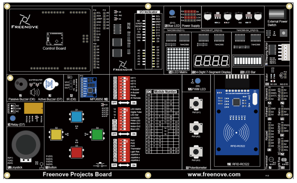
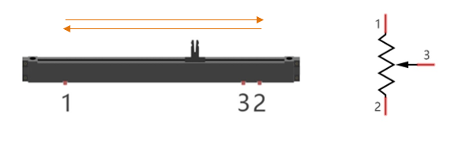
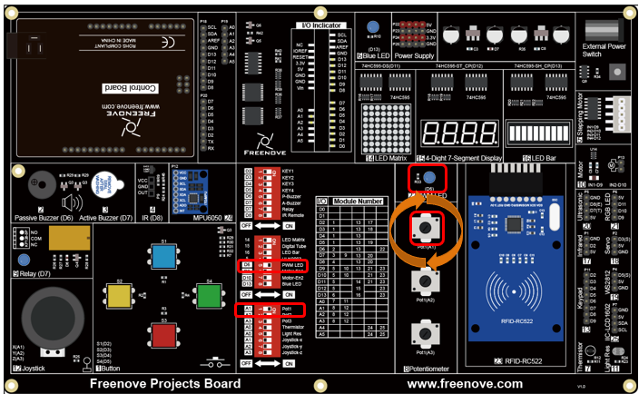

##############################################################################
Chapter ADC
##############################################################################

Earlier, we have learned the digital ports of control board, and tried the output and input signals. Now, let us learn how to use analog ports.

Project 5.1 ADC
***************************

ADC is used to convert analog signals into digital signals. The control chip on the control board has integrated this function. Now let us try to use it to convert analog signals into digital signals.

Component List
================================

+-------------------------+----------------+
| Control board x1        | USB cable x1   |
|                         |                |
| |Chapter01_00|          | |Chapter01_01| |
+-------------------------+----------------+
| Freenove Projects Board                  |
|                                          |
| |Chapter01_02|                           |
+------------------------------------------+

.. |Chapter01_00| image:: ../_static/imgs/1_LED_Blink/Chapter01_00.png
.. |Chapter01_01| image:: ../_static/imgs/1_LED_Blink/Chapter01_01.png

Circuit Knowledge
================================

ADC
--------------------------------

An ADC is an electronic integrated circuit used to convert analog signals such as voltages to digital or binary form consisting of 1s and 0s. The range of our ADC module is 10 bits, that means the resolution is 2^10=1024, so that its range (at 5V) will be divided equally into 1024 parts. 

Any analog value can be mapped to one digital value using the resolution of the converter. So the more bits the ADC has, the denser the partition of analog will be and the greater the precision of the resulting conversion.

Subsection 1: the analog in rang of 0V-5/1024V corresponds to digital 0;

Subsection 2: the analog in rang of 5 /1024V-2*5/1024V corresponds to digital 1;

The following analog signal will be divided accordingly.

Component Knowledge
=========================

Potentiometer
-------------------------

Potentiometer is a resistive element with three Terminal parts. Unlike the resistors that we have used thus far in our project which have a fixed resistance value, the resistance value of a potentiometer can be adjusted. A potentiometer is often made up by a resistive substance (a wire or carbon element) and movable contact brush. When the brush moves along the resistor element, there will be a change in the resistance of the potentiometer’s output side (3) (or change in the voltage of the circuit that is a part). The illustration below represents a linear sliding potentiometer and its electronic symbol on the right.

Between potentiometer pin 1 and pin 2 is the resistive element (a resistance wire or carbon) and pin 3 is connected to the brush that makes contact with the resistive element. In our illustration, when the brush moves from pin 1 to pin 2, the resistance value between pin 1 and pin 3 will increase linearly (until it reaches the highest value of the resistive element) and at the same time the resistance between pin 2 and pin 3 will decrease linearly and conversely down to zero. At the midpoint of the slider the measured resistance values between pin 1 and 3 and between pin 2 and 3 will be the same.

In a circuit, both sides of resistive element are often connected to the positive and negative electrodes of power. When you slide the brush “pin 3”, you can get variable voltage within the range of the power supply.

Rotary potentiometer
-------------------------

Rotary potentiometer and linear potentiometer have the same function; the only difference being the physical action being a rotational rather than a sliding movement.

Circuit
=========================

Use pin A1 on the control board to detect the voltage of rotary potentiometer.

+-------------------------+-----------------------------------------------------------+
| Schematic diagram       | Hardware connection                                       |
|                         |                                                           |
| |Chapter05_04|          | |Chapter05_05|                                            |
+-------------------------+-----------------------------------------------------------+
| Hardware connection                                                                 |
|                                                                                     |
| Insert the Control Board to Freenove Projects Board, and then turn the corresponding|
|                                                                                     |
| switch to the right(ON).                                                            |
|                                                                                     |
| |Chapter05_06|                                                                      |
+-------------------------------------------------------------------------------------+

Sketch
========================

ADC
------------------------

Now, write code to detect the voltage of rotary potentiometer, and send the data to Serial Monitor window of Arduino IDE through serial port.

.. literalinclude:: ../../../freenove_Kit/Sketches/Sketch_05.1_ADC/Sketch_05.1_ADC.ino
    :linenos: 
    :language: c
    :dedent:

From the code, we get the ADC value of pin A1, then convert it into voltage and sent to the serial port.

Verify and upload the code, open the Serial Monitor, and then you will see the original ADC value and converted voltage sent from control board.

Turn the rotary potentiometer shaft, and you can see the voltage change.

Project 5.2 Control LED by Potentiometer
*************************************************

In the previous section, we have finished reading ADC value and converting it into voltage. Now, we will try to use potentiometer to control the brightness of LED.

Component List
================================

+-------------------------+----------------+
| Control board x1        | USB cable x1   |
|                         |                |
| |Chapter01_00|          | |Chapter01_01| |
+-------------------------+----------------+
| Freenove Projects Board                  |
|                                          |
| |Chapter01_02|                           |
+------------------------------------------+

Circuit
=========================

Use pin A1 on the control board to detect the voltage of rotary potentiometer.

+-------------------------+-----------------------------------------------------------+
| Schematic diagram       | Hardware connection                                       |
|                         |                                                           |
| |Chapter05_08|          | |Chapter05_09|                                            |
+-------------------------+-----------------------------------------------------------+
| Hardware connection                                                                 |
|                                                                                     |
| Insert the Control Board to Freenove Projects Board, and then turn the corresponding|
|                                                                                     |
| switch to the right(ON).                                                            |
|                                                                                     |
| |Chapter05_10|                                                                      |
+-------------------------------------------------------------------------------------+

Sketch
================================

Control_LED_by_Potentiometer
--------------------------------

.. literalinclude:: ../../../freenove_Kit/Sketches/Sketch_05.2_Control_LED_by_Potentiometer/Sketch_05.2_Control_LED_by_Potentiometer.ino
    :linenos: 
    :language: c
    :dedent:

In the code, we get the ADC value of pin A1 and map it to PWM duty cycle of LED pin port. With different LED brightness, we can see the changes of voltage easily.

Verify and upload the code, rotate the rotary potentiometer shaft, you will see the LED brightness change.

.. list-table:: 
    :width: 80%
    :align: center
    :class: product-table

    *   -   |Chapter05_11|
        -   |Chapter05_12|
    *   -   |Chapter05_13|
        -   |Chapter05_14|

.. py:function:: map(value, fromLow, fromHigh, toLow, toHigh)

    This function is used to remap a value, which will return a new value whose percentage in the range of toLow-toHigh is equal to the percentage of "value" in the range of fromLow-fromHigh. For example, 1 is the maximum in the range of 0-1 and the maximum value in the scope of 0-2 is 2, that is, the result value of map (1, 0, 1, 0, 2) is 2.

Project 5.3 Control LED by Photoresistor
**********************************************

In the previous section, we have finished reading ADC value and converted it into LED brightness. There are many components, especially the sensor whose output is analog. Now, we will try to use photoresistor to measure the brightness of light.

+-------------------------+----------------+
| Control board x1        | USB cable x1   |
|                         |                |
| |Chapter01_00|          | |Chapter01_01| |
+-------------------------+----------------+
| Freenove Projects Board                  |
|                                          |
| |Chapter01_02|                           |
+------------------------------------------+

Component Knowledge
==========================

Photoresistor
-----------------------

A Photoresistor is simply a light sensitive resistor. It is an active component that decreases resistance with respect to receiving luminosity (light) on the component's light sensitive surface. A Photoresistor’s resistance value will change in proportion to the ambient light detected. With this characteristic, we can use a Photoresistor to detect light intensity. The Photoresistor and its electronic symbol are as follows.

.. image:: ../_static/imgs/5_ADC/Chapter05_15.png
    :align: center

The circuit below is often used to detect the change of photoresistor's resistance value:

In the above circuit, when a photoresistor's resistance value changes due to a change in light intensity, the voltage between the photoresistor and resistor R1 will also change, so the intensity of the light can be obtained by measuring the voltage.

Circuit
==========================

Use pin A0 on control board to detect the voltage of photoresistor, and use pin 6 to control one LED.

+-------------------------+-----------------------------------------------------------+
| Schematic diagram       | Hardware connection                                       |
|                         |                                                           |
| |Chapter05_17|          | |Chapter05_18|                                            |
+-------------------------+-----------------------------------------------------------+
| Hardware connection                                                                 |
|                                                                                     |
| Insert the Control Board to Freenove Projects Board, and then turn the corresponding|
|                                                                                     |
| switch to the right(ON).                                                            |
|                                                                                     |
| |Chapter05_19|                                                                      |
+-------------------------------------------------------------------------------------+

Sketch
==========================

Control_LED_through_Photoresistor
------------------------------------------

Now, write code to detect the voltage of the rotary potentiometer, and control LED to emit light with different brightness according to that.

.. literalinclude:: ../../../freenove_Kit/Sketches/Sketch_05.3_Control_LED_through_Photoresistor/Sketch_05.3_Control_LED_through_Photoresistor.ino
    :linenos: 
    :language: c
    :dedent:

In the code, we get the ADC value of pin A0, map it to PWM duty cycle of LED pin port. According to the brightness of LED, we can see the changes of voltage easily.

Verify and upload the code, cover photoresistor with your hand, then you can see the LED's brightness changes.

