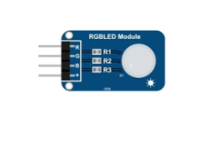
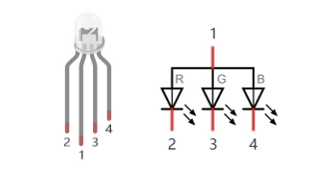
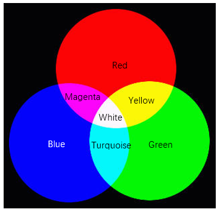
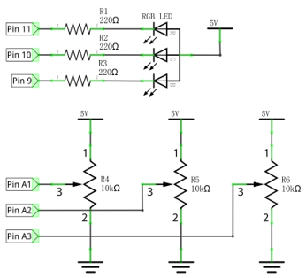
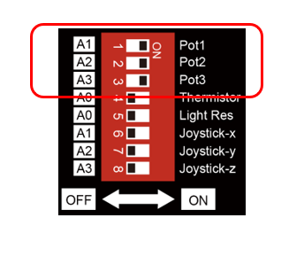
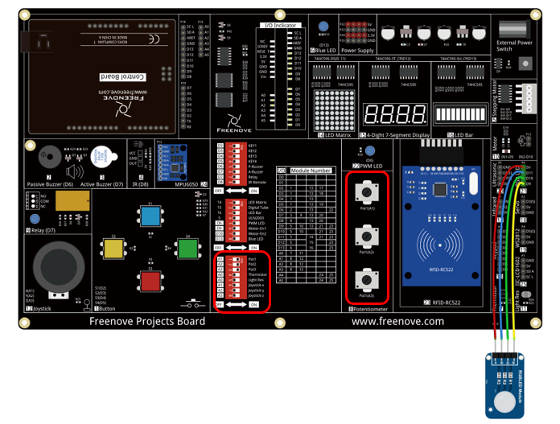
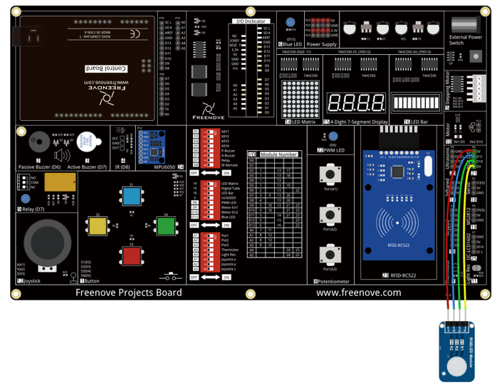

##############################################################################
Chapter RGB LED
##############################################################################

Earlier, we have learned to use the analog port and ADC of the control board. Now, we'll use ADC to control RGB LED.

Project 6.1 Control RGB LED through Potentiometer
******************************************************

RGB LED has three different-color LEDs inside. We will use 3 potentiometers to control these 3 LEDs respectively to emit light with different brightness, and observe what will happen.

Component List
==============================

+-------------------------+------------------------------+-------------------------------+
| Control board x1        | USB cable x1                 | RGB LED x1                    |
|                         |                              |                               |
| |Chapter06_00|          | |Chapter06_01|               | |Chapter06_02|                |
+-------------------------+------------------------------+-------------------------------+
| Jumper Wire x4                                                                         |
|                                                                                        |
| |Chapter06_03|                                                                         |
+----------------------------------------------------------------------------------------+
| Freenove Projects Board                                                                |
|                                                                                        |
| |Chapter06_04|                                                                         |
+----------------------------------------------------------------------------------------+

.. |Chapter06_00| image:: ../_static/imgs/6_RGB_LED/Chapter06_00.png
.. |Chapter06_01| image:: ../_static/imgs/6_RGB_LED/Chapter06_01.png

.. |Chapter06_03| image:: ../_static/imgs/6_RGB_LED/Chapter06_03.png
.. |Chapter06_04| image:: ../_static/imgs/6_RGB_LED/Chapter06_04.png

Component Knowledge
==========================
RGB LED
---------------------------

An RGB LED has 3 LEDs integrated into one LED component. It can respectively emit Red, Green and Blue light. In order to do this, it requires 4 pins (this is also how you identify it). The long pin (1) is the common which is the Anode (+) or positive lead, the other 3 are the Cathodes (-) or negative leads. A rendering of a RGB LED and its electronic symbol are shown below. We can make RGB LED emit various colors of light and brightness by controlling the 3 Cathodes (2, 3 & 4) of the RGB LED

Red, Green, and Blue light are called 3 Primary Colors when discussing light (Note: for pigments such as paints, the 3 Primary Colors are Red, Blue and Yellow). When you combine these three Primary Colors of light with varied brightness, they can produce almost any color of visible light. Computer screens, single pixels of cell phone screens, neon lamps, etc. can all produce millions of colors due to phenomenon.

We know from the previous section that, control board controls LED to emit a total of 256(0-255) different brightness via PWM. Therefore, through different combinations of RGB light brightness, we can create 256^3=16777216(16Million) colors.

Circuit
=============================

Use pin A1, A2, A3 ports of the control board to detect the voltage of rotary potentiometer, and control RGB LED by pin 9, 10, 11.

+-------------------------+-----------------------------------------------------------+
| Schematic diagram       | Hardware connection                                       |
|                         |                                                           |
| |Chapter06_07|          | |Chapter06_08|                                            |
+-------------------------+-----------------------------------------------------------+
| Hardware connection                                                                 |
|                                                                                     |
| Insert the Control Board to Freenove Projects Board, and then turn the corresponding|
|                                                                                     |
| switch to the right(ON).                                                            |
|                                                                                     |
| |Chapter06_09|                                                                      |
+-------------------------------------------------------------------------------------+

Sketch
================================

Control_RGB_LED_through_Potentiometer
-----------------------------------------

Now, write code to detect the voltages of these three rotary potentiometers, and convert them into PWM duty cycle to control 3 LEDs inside the RGB LED.

.. literalinclude:: ../../../freenove_Kit/Sketches/Sketch_06.1_Control_RGB_LED_through_Potentiometer/Sketch_06.1_Control_RGB_LED_through_Potentiometer.ino
    :linenos: 
    :language: c
    :dedent:

In the code, we get the voltages of three rotary potentiometers, and convert them into PWM duty cycle to control the three LEDs of the RGB LED to emit light with different brightness.

Verify and upload the code, rotate the three rotary potentiometer shaft, and you can see the LED light changes in its color and brightness.

Project 6.2 Multicolored LED
************************************

In the previous section, we have finished controlling the RGB LED to emit light with different color and brightness through three potentiometers. Now, we will try to make RGB LED emit multicolored lights automatically.

Component List
==============================

+-------------------------+------------------------------+-------------------------------+
| Control board x1        | USB cable x1                 | RGB LED x1                    |
|                         |                              |                               |
| |Chapter06_00|          | |Chapter06_01|               | |Chapter06_02|                |
+-------------------------+------------------------------+-------------------------------+
| Jumper Wire x4                                                                         |
|                                                                                        |
| |Chapter06_03|                                                                         |
+----------------------------------------------------------------------------------------+
| Freenove Projects Board                                                                |
|                                                                                        |
| |Chapter06_04|                                                                         |
+----------------------------------------------------------------------------------------+

Circuit
=============================

Use pin 9, 10, 11 of the control board to control RGB LED.

.. list-table:: 
    :width: 80%
    :align: center
    :class: product-table

    *   -   Schematic diagram
    *   -   |Chapter06_10|
    *   -   Hardware connection
    *   -   |Chapter06_11|

Sketch
=============================

Colorful_LED
-----------------------------

Now, write code to generate three random numbers, and convert them into PWM duty cycle to control the three LEDs of RGB LED.

.. literalinclude:: ../../../freenove_Kit/Sketches/Sketch_06.2_Colorful_LED/Sketch_06.2_Colorful_LED.ino
    :linenos: 
    :language: c
    :dedent:

In the code, we create three random numbers, and convert them into PWM duty cycle to control the three LEDs of RGB LED to emit light with different brightness. At regular intervals, a new random number will be created, so RGB LED will start flashing light with different colors and brightness.

.. py:function:: random(min, max)

    random (min, max) function is used to generate random number, and it will return a random value in the range (min, Max-1).

    You can also use random (max) function, the function set the minimum value into 0 by default, and returns a random value in the range (0, Max-1).

Verify and upload the code, and RGB LED starts flashing with different colors and brightness.