##############################################################################
Chapter
##############################################################################

This chapter will help you learn to use a more convenient WS2812 LED, which requires only one GPIO control and can be connected in infinite series in theory. Each LED can be controlled independently.

Project 7.1 LEDPixel
**************************

Learn the basic usage of LEDPixel and make it blink red, green, blue and white lights.

Component List
===========================

+-------------------------+------------------------------+-------------------------------+
| Control board x1        | USB cable x1                 | LEDPixel x1                   |
|                         |                              |                               |
| |Chapter06_00|          | |Chapter06_01|               | |Chapter07_00|                |
+-------------------------+------------------------------+-------------------------------+
| Jumper Wire x4                                                                         |
|                                                                                        |
| |Chapter06_03|                                                                         |
+----------------------------------------------------------------------------------------+
| Freenove Projects Board                                                                |
|                                                                                        |
| |Chapter06_04|                                                                         |
+----------------------------------------------------------------------------------------+

.. |Chapter06_00| image:: ../_static/imgs/6_RGB_LED/Chapter06_00.png
.. |Chapter06_01| image:: ../_static/imgs/6_RGB_LED/Chapter06_01.png
.. |Chapter07_00| image:: ../_static/imgs/6_RGB_LED/Chapter07_00.png
.. |Chapter06_03| image:: ../_static/imgs/6_RGB_LED/Chapter06_03.png
.. |Chapter06_04| image:: ../_static/imgs/6_RGB_LED/Chapter06_04.png

Related knowledge
===========================

Freenove 8 RGB LED Module  

The Freenove 8 RGB LED Module is as below. 

It consists of 8 WS2812, each of which requires only one pin to control and supports cascading. Each WS2812 has integrated 3 LEDs, red, green and blue respectively, and each of them supports 256-level brightness adjustment, which means that each WS2812 can emit 2^24=16,777,216 different colors.

You can use only one data pin to control eight LEDs on the module. As shown below:

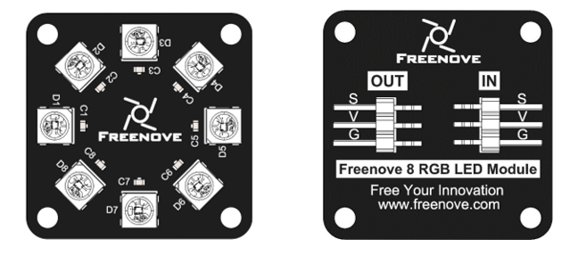

And you can also control many modules at the same time. Just connect OUT pin of one module to IN pin of another module. In this way, you can use one data pin to control 8, 16, 32 … LEDs.

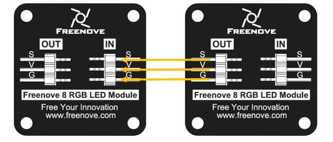

Pin description:

+---------------------------------------+---------------------------------------+
|                  (IN)                 |                 (OUT)                 |
+========+==============================+========+==============================+
| symbol | Function                     | symbol | Function                     |
+--------+------------------------------+--------+------------------------------+
| S      | Input control signal         | S      | Output control signal        |
+--------+------------------------------+--------+------------------------------+
| V      | Power supply pin, +3.5V~5.5V | V      | Power supply pin, +3.5V~5.5V |
+--------+------------------------------+--------+------------------------------+
| G      | GND                          | G      | GND                          |
+--------+------------------------------+--------+------------------------------+

Circuit
=============================

.. list-table:: 
    :width: 100%
    :align: center
    :class: product-table

    *   -   Schematic diagram
    *   -   |Chapter07_03|
    *   -   Hardware connection
    *   -   |Chapter07_04|
    *   -   |Chapter07_05|

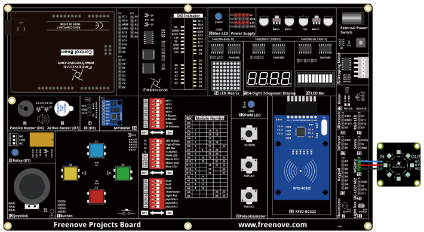
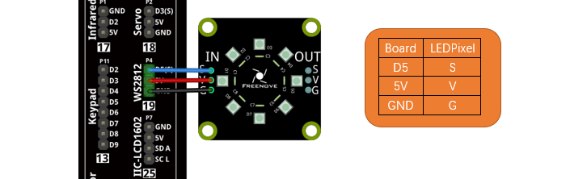

Sketch
=============================

This code uses a library named " Adafruit NeoPixel", if you have not installed it, please do so first.

Library is an important feature of the open source world, and we know that Arduino is an open source platform that everyone can contribute to. Libraries are generally licensed under the LGPL, which means you can use them for free to apply to your creations.

How to install the library
-----------------------------

There are two ways to add libraries.

The first way, open the Arduino IDE, click Tools Manage Libraries.

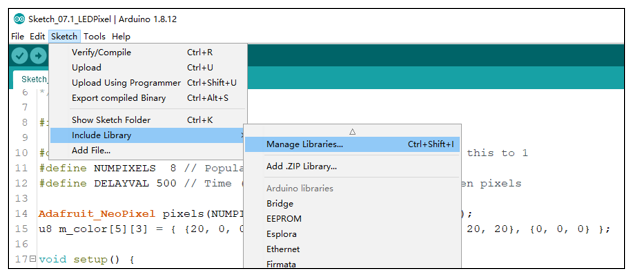

In the pop-up window, Library Manager, search for the name of the Library, “Adafruit NeoPixel”, and then click Install.

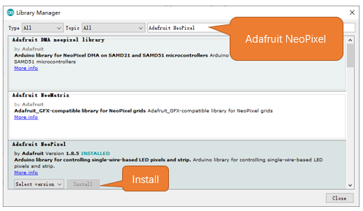

The second wayl, open Arduino IDE, click SketchInclude LibraryAdd .ZIP Library. In the pop-up window, find the file named “./Libraries/ Adafruit_NeoPixel.Zip” which locates in this directory, and click OPEN.

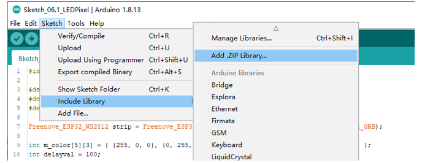

LEDPixel
--------------------------

The following is the program code:

.. literalinclude:: ../../../freenove_Kit/Sketches/Sketch_07.1_LEDPixel/Sketch_07.1_LEDPixel.ino
    :linenos: 
    :language: c
    :dedent:

Download the code to Control Board, and LEDPixel begins to light up in red, green, blue, white and black.

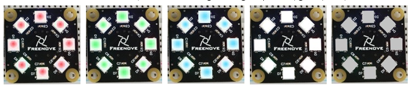

To use some libraries, first you need to include the library's header file.

.. literalinclude:: ../../../freenove_Kit/Sketches/Sketch_07.1_LEDPixel/Sketch_07.1_LEDPixel.ino
    :linenos: 
    :language: c
    :dedent:
    :lines: 8-8

Define the pins connected to the module and the number of LEDs on it,

.. literalinclude:: ../../../freenove_Kit/Sketches/Sketch_07.1_LEDPixel/Sketch_07.1_LEDPixel.ino
    :linenos: 
    :language: c
    :dedent:
    :lines: 10-11

Define a variable to set the time interval for each LED to light up. The smaller the value, the shorter the time interval between each two LEDs.

.. literalinclude:: ../../../freenove_Kit/Sketches/Sketch_07.1_LEDPixel/Sketch_07.1_LEDPixel.ino
    :linenos: 
    :language: c
    :dedent:
    :lines: 12-12

Use the above parameters to create a LEDPixel object strip.

.. literalinclude:: ../../../freenove_Kit/Sketches/Sketch_07.1_LEDPixel/Sketch_07.1_LEDPixel.ino
    :linenos: 
    :language: c
    :dedent:
    :lines: 14-14

Define the color values to be used, as red, green, blue, white, and black.

.. literalinclude:: ../../../freenove_Kit/Sketches/Sketch_07.1_LEDPixel/Sketch_07.1_LEDPixel.ino
    :linenos: 
    :language: c
    :dedent:
    :lines: 15-15

Initialize pixels() in setup().

.. literalinclude:: ../../../freenove_Kit/Sketches/Sketch_07.1_LEDPixel/Sketch_07.1_LEDPixel.ino
    :linenos: 
    :language: c
    :dedent:
    :lines: 18-18

In the loop() function, before assigning a new color to LEDPixel, call the clear() function to clear the original color.

.. literalinclude:: ../../../freenove_Kit/Sketches/Sketch_07.1_LEDPixel/Sketch_07.1_LEDPixel.ino
    :linenos: 
    :language: c
    :dedent:
    :lines: 22-22

Call setPixelColor() function to set the color for each LED on LEDPixels. LEDPixel won’t emit lights until the show() function is called.

Use for loop to set color data for each LED, and then call show() function to make LEDPixel emit colors.

.. literalinclude:: ../../../freenove_Kit/Sketches/Sketch_07.1_LEDPixel/Sketch_07.1_LEDPixel.ino
    :linenos: 
    :language: c
    :dedent:
    :lines: 24-27

Reference
-------------------------------

.. py:function:: Adafruit_NeoPixel(uint16_t n, uint16_t pin=6,neoPixelType type=NEO_GRB + NEO_KHZ800);

    Every time you use LEDPixel, you need to create an LEDPixel object first.
    
    n: the number of LEDs.
    
    pin: The pin number of the Control Board to drive the LEDPixel data in.
    
    type: The setting of the LED's built-in driver protocol type and driving speed.
    
    Driver Protocol:
    
    NEO_RGB: The order of loading colors for the LEDPixel module is red, green, and blue.
    
    NEO_RBG: The order of loading colors for the LEDPixel module is red, blue, and green.
    
    NEO_GRB: The order of loading colors for the LEDPixel module is green, red, and blue.
    
    NEO_GBR: The order of loading colors for the LEDPixel module is green, blue, and red.
    
    NEO_BRG: The order of loading colors for the LEDPixel module is blue, red, and green.
    
    NEO_BGR: The order of loading colors for the LEDPixel module is blue, green, and red.

.. py:function:: void begin(void);

    Initialize the LEDPixel object.

.. py:function:: void setPixelColor(uint16_t n, uint8_t r, uint8_t g, uint8_t b);
.. py:function:: void setPixelColor(uint16_t n, uint8_t r, uint8_t g, uint8_t b, uint8_t w);
.. py:function:: void setPixelColor(uint16_t n, uint32_t c);

    Set the color of LED with sequence number n.

.. py:function:: void show(void);

    Send the color data to the LED and display the color immediately.

.. py:function:: void setBrightness(uint8_t);

    Set the brightness of the LED.

Project 7.2 Rainbow Light
****************************************

In the previous project, we have mastered the use of LEDPixel. This project will make a slightly complicated rainbow light. The component list and the circuit are exactly the same as the project LEDPixel.

+-------------------------+----------------------+
| Control board x1        | USB cable x1         |
|                         |                      |
| |Chapter07_10|          | |Chapter07_11|       |
+-------------------------+----------------------+
| Jumper Wire x4                                 |
|                                                |
| |Chapter07_12|                                 |
+------------------------------------------------+
| |Chapter07_13|                                 |
+------------------------------------------------+

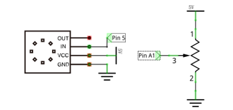
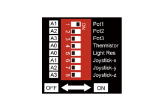
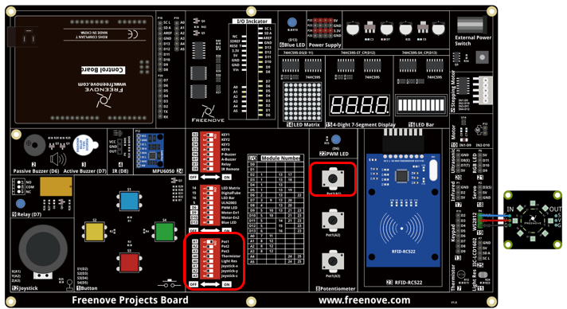
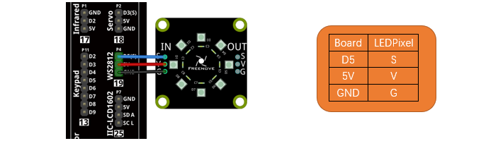

Sketch
=========================================

Continue to use the following color model to equalize the color distribution of the 8 LEDs and gradually change. 

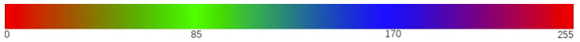

RainbowLight
--------------------------------

.. literalinclude:: ../../../freenove_Kit/Sketches/Sketch_07.2_RainbowLight/Sketch_07.2_RainbowLight.ino
    :linenos: 
    :language: c
    :dedent:

Upload code to the control board. Rotate the potentiometer and the color of LEDPixel will change accordingly.

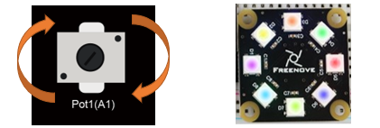

With the color model, write the Wheel() function to convert the color model into the corresponding color data.

.. literalinclude:: ../../../freenove_Kit/Sketches/Sketch_07.2_RainbowLight/Sketch_07.2_RainbowLight.ino
    :linenos: 
    :language: c
    :dedent:
    :lines: 32-43

The range of the color model is 0-255. Get the ADC value of the potentiometer and map it to the color model range, to get the offset value in the color model corresponding to the rotation of the potentiometer.

.. literalinclude:: ../../../freenove_Kit/Sketches/Sketch_07.2_RainbowLight/Sketch_07.2_RainbowLight.ino
    :linenos: 
    :language: c
    :dedent:
    :lines: 21-22

Take NUMBER points evenly from the color model, and add the offset value of the potentiomter to each point to get the color point of each LED in actual display. Call the Wheel function to convert the color points into the corresponding color data and set the Neopixel..

.. literalinclude:: ../../../freenove_Kit/Sketches/Sketch_07.2_RainbowLight/Sketch_07.2_RainbowLight.ino
    :linenos: 
    :language: c
    :dedent:
    :lines: 23-25