##############################################################################
Chapter Buzzer
##############################################################################

Earlier, we have used control board and basic electronic components to carry out a series of interesting projects. Now, let's learn how to use some integrated electronic components and modules. These modules are usually integrated with a number of electronic components, so they have special features and usages.

In this chapter, we'll use a sounding module, buzzer. It has two types: active and passive buzzer.

Project 8.1 Active Buzzer
***************************************

First, let's study some knowledge about the active buzzer.

Component List
=======================================

+-------------------------+----------------+
| Control board x1        | USB cable x1   |
|                         |                |
| |Chapter01_00|          | |Chapter01_01| |
+-------------------------+----------------+
| Freenove Projects Board                  |
|                                          |
| |Chapter01_02|                           |
+------------------------------------------+

.. |Chapter01_00| image:: ../_static/imgs/1_LED_Blink/Chapter01_00.png
.. |Chapter01_01| image:: ../_static/imgs/1_LED_Blink/Chapter01_01.png
.. |Chapter01_02| image:: ../_static/imgs/1_LED_Blink/Chapter01_02.png

Component knowledge
=========================================

Transistor
-----------------------------------------

Transistor, the full name: semiconductor transistor, is a semiconductor device that controls current (think of a transistor as an electronic “amplifying or switching device”). Transistors can be used to amplify weak signals, or to work as a switch. Transistors have three electrodes(PINs): base (b), collector (c) and emitter (e). When there is current passing between "be", then "ce" will have a several-fold current increase (transistor magnification), in this configuration the transistor acts as an amplifier. When current produced by "be" exceeds a certain value, "ce" will limit the current output. at this point the transistor is working in its saturation region and acts like a switch. Transistors are available as two types as shown below: PNP and NPN,

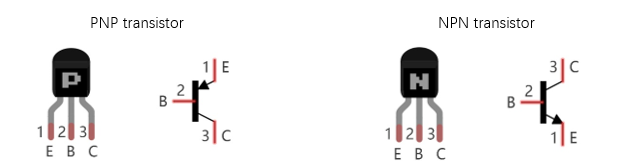

.. container:: centered
    
    **In our kit, the PNP transistor is marked with 8550, and the NPN transistor is marked with 8050.**

Thanks to the transistors' characteristics, they are often used as switches in digital circuits. As micro-controllers output current capacity is very weak, we will use a transistor to amplify its current in order to drive components requiring higher current.

Buzzer
-----------------------------------------

A buzzer is an audio component. They are widely used in electronic devices such as calculators, electronic alarm clocks, automobile fault indicators, etc. There are both active and passive types of buzzers. Active buzzers have oscillator inside, these will sound as long as power is supplied. Passive buzzers require an external oscillator signal (generally using PWM with different frequencies) to make a sound.

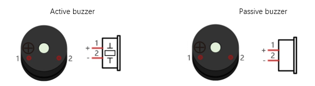

.. note:: 
    
    A white label is attached to the active buzzer

Active buzzers are easier to use. Generally, they only make a specific sound frequency. Passive buzzers require an external circuit to make sounds, but passive buzzers can be controlled to make sounds of various frequencies. The resonant frequency of the passive buzzer in this Kit is 2kHz, which means the passive buzzer is the loudest when its resonant frequency is 2kHz.

:red:`How to identify active and passive buzzer?`

1.	As a rule, there is a label on an active buzzer covering the hole where sound is emitted, but there are exceptions to this rule.

2.	Active buzzers are more complex than passive buzzers in their manufacture. There are many circuits and crystal oscillator elements inside active buzzers; all of this is usually protected with a waterproof coating (and a housing) exposing only its pins from the underside. On the other hand, passive buzzers do not have protective coatings on their underside. From the pin holes, view of a passive buzzer, you can see the circuit board, coils, and a permanent magnet (all or any combination of these components depending on the model.

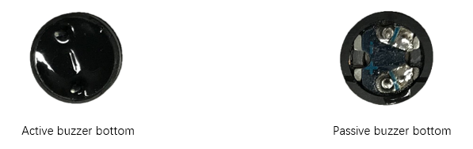

Buzzers need relatively larger current when they work. But generally, microcontroller port can’t provide enough current for them. In order to control buzzer by control board, transistor can be used to drive a buzzer indirectly.

When we use a NPN transistor to drive a buzzer, we often use the following method. If control board pin outputs high level, current will flow through R1 (Resistor 1), the transistor conducts current and the buzzer will make sounds. If control board pin outputs low level, no current will flow through R1, the transistor will not conduct current and buzzer will remain silent (no sounds).

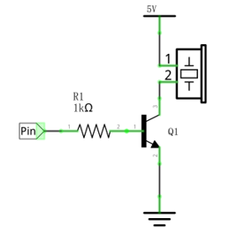

When we use a PNP transistor to drive a buzzer, we often use the following method. If control board pin outputs low level, current will flow through R1. The transistor conducts current and the buzzer will make sounds. If control board pin outputs high level, no current flows through R1, the transistor will not conduct current and buzzer will remain silent (no sounds). Below are the circuit schematics for both a NPN and PNP transistor to power a buzzer.

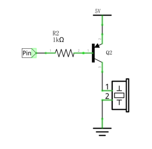

Circuit
==========================================

Drive the active buzzer with pin7.

+-------------------------+----------------------------------+
| Schematic diagram       | Hardware connection              |
|                         |                                  |
| |Chapter08_05|          | |Chapter08_06|                   |
+-------------------------+----------------------------------+
| Hardware connection                                        |
|                                                            |
| |Chapter08_07|                                             |
+------------------------------------------------------------+

.. |Chapter08_05| image:: ../_static/imgs/8_Buzzer/Chapter08_05.png
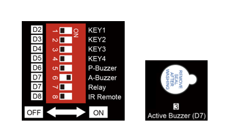
.. |Chapter08_07| image:: ../_static/imgs/8_Buzzer/Chapter08_07.png

Sketch
=========================================

Active_Buzzer
----------------------------------------

The usage of active buzzer is similar to that of the LED. The pin on Freenove Projects Board outputs high or low level to control the active buzzer’s ON or OFF.

.. literalinclude:: ../../../freenove_Kit/Sketches/Sketch_08.1_Active_Buzzer/Sketch_08.1_Active_Buzzer.ino
    :linenos: 
    :language: c
    :dedent:

Verify and upload the code, and the active buzzer will make a sound.

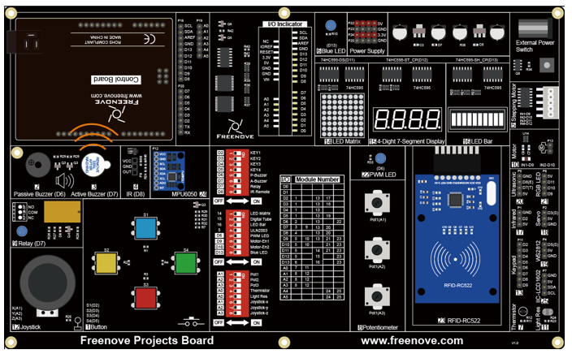

Project 8.2 Passive Buzzer
******************************************

In the previous section, we have finished using transistor to drive an active buzzer to beep. Now, we will try to use a passive buzzer to make a sound with different frequency.

Component List
================================

+-------------------------+----------------+
| Control board x1        | USB cable x1   |
|                         |                |
| |Chapter01_00|          | |Chapter01_01| |
+-------------------------+----------------+
| Freenove Projects Board                  |
|                                          |
| |Chapter01_02|                           |
+------------------------------------------+

.. |Chapter01_00| image:: ../_static/imgs/1_LED_Blink/Chapter01_00.png
.. |Chapter01_01| image:: ../_static/imgs/1_LED_Blink/Chapter01_01.png
.. |Chapter01_02| image:: ../_static/imgs/1_LED_Blink/Chapter01_02.png

Circuit
==========================================

Use pin 6 port of control board to drive a passive buzzer.

+-------------------------+----------------------------------+
| Schematic diagram       | Hardware connection              |
|                         |                                  |
| |Chapter08_09|          | |Chapter08_10|                   |
+-------------------------+----------------------------------+
| Hardware connection                                        |
|                                                            |
| |Chapter08_11|                                             |
+------------------------------------------------------------+

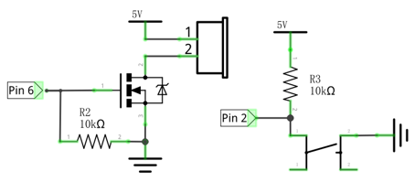
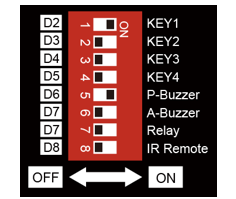
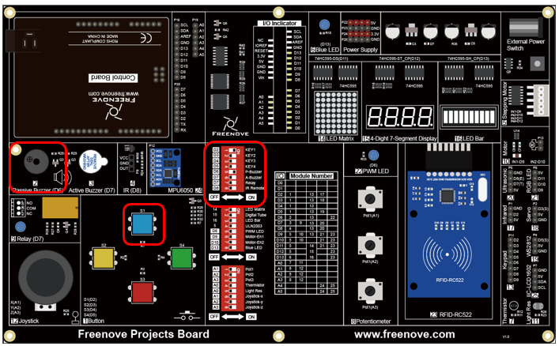

Sketch
========================

Passive_Buzzer
--------------------------

Now, write code to drive a passive buzzer to make a warning sound. The frequency of the passive buzzer conforms roughly to the following sine curve over time:

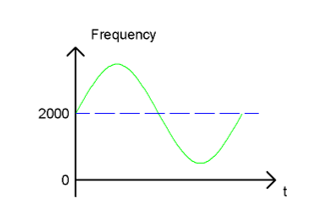

When the key is pressed, the passive buzzer will make sounds in different frequence; When leased, the buzzer stops sounding.

.. literalinclude:: ../../../freenove_Kit/Sketches/Sketch_08.2_Passive_Buzzer/Sketch_08.2_Passive_Buzzer.ino
    :linenos: 
    :language: c
    :dedent:

In the code, use one loop to control the sound frequency, varying according to sine curve in the range of 2000±500.

.. literalinclude:: ../../../freenove_Kit/Sketches/Sketch_08.2_Passive_Buzzer/Sketch_08.2_Passive_Buzzer.ino
    :linenos: 
    :language: c
    :dedent:
    :lines: 20-25

The parameter of sin() function is radian, so we need convert unit of π from angle to radian first .

.. py:function:: tone(pin, frequency)

    Generates a square wave of the specified frequency (and 50% duty cycle) on a pin. 