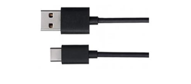

##############################################################################
Chapter Relay
##############################################################################

In this chapter, we will learn how to control a relay.

Project 9.1 Control Relay
************************************

Component List
=======================================

+-------------------------+----------------+
| Control board x1        | USB cable x1   |
|                         |                |
| |Chapter01_00|          | |Chapter01_01| |
+-------------------------+----------------+
| Freenove Projects Board                  |
|                                          |
| |Chapter01_02|                           |
+------------------------------------------+

.. |Chapter01_00| image:: ../_static/imgs/1_LED_Blink/Chapter01_00.png

.. |Chapter01_02| image:: ../_static/imgs/1_LED_Blink/Chapter01_02.png

Component Knowledge
===================================

Capacitor
-------------------------------------

The unit of capacitance(C) is farad (F). 1F=1000000μF, 1μF=1000000pF.

A Capacitor is an energy storage device, with a certain capacitance. When capacitor's voltage increases, the capacitor will be charged; And the capacitor will be discharged when its voltage drops. So capacitor’s voltage of both ends is not transient. According to this characteristic, capacitors are often used to stabilize the voltage of power supply, and filter the signal. Capacitors with large capacity can filter out low frequency signals, and small-capacity capacitor can filter out high frequency signals.

There are 2 kinds of capacitors: non-polar capacitors and polar capacitors. Generally, a non-polar capacitor has small capacitance, and a ceramic non-polar capacitor is shown below.

For polar capacitor, it usually has larger capacitance, and an electrolytic polar capacitor of that is shown below:

When the motor rotates, it will generate noise. As the contact of coil connects and disconnects the electrode constantly, it will cause the supply voltage unstable. Thus, a small capacitor is often connected to motor to reduce the impact on power supply from motor.

Relay
-----------------------------------

Relays are a type of Switch that open and close circuits electromechanically or electronically. Relays control one electrical circuit by opening and closing contacts in another circuit using an electromagnet to initiate the Switch action. When the electromagnet is energized (powered), it will attract internal contacts completing a circuit, which act as a Switch. Many times Relays are used to allow a low powered circuit (and a small low amperage switch) to safely turn ON a larger more powerful circuit. They are commonly found in automobiles, especially from the ignition to the starter motor.

The following is the image and circuit symbol diagram of the 5V relay used in this project:

Pin 5 and pin 6 are internally connected to each other. When the coil pin3 and pin 4 are connected to a 5V power supply, pin 1 will be disconnected from pins 5 & 6 and pin 2 will be connected to pins 5 & 6. Pin 1 is called Closed End and pin 2 is called the Open End.

Inductor
----------------------------------

The symbol of inductance is “L” and the unit of inductance is the “Henry” (H). Here is an example of how this can be encountered: 1H=1000mH, 1mH=1000μH.

An inductor is a passive device that stores energy in its magnetic field and returns energy to the circuit whenever required. An inductor is formed by a Cylindrical Core with many turns of conducting wire (usually copper wire). Inductors will hinder the changing current passing through it. When the current passing through the inductor increases, it will attempt to hinder the increasing movement of current; and when the current passing through the inductor decreases, it will attempt to hinder the decreasing movement of current. So the current passing through an inductor is not transient.

The circuit for a relay is as follows: The coil of relay can be equivalent to an Inductor, when a transistor is present in this coil circuit it can disconnect the power to the relay, the current in the Relay’s coil does not stop immediately, which affects the power supply adversely. To remedy this, diodes in parallel are placed on both ends of the relay coil pins in opposite polar direction. Having the current pass through the diodes will avoid any adverse effect on the power supply.

Circuit
-----------------------------------

Use pin 2 of control board to detect the state of push button switch, and pin 7 to control the relay. As the running of motor needs larger power, we will use two AA batteries to supply power for the motor alone.

+-------------------------+----------------------------------+
| Schematic diagram       | Hardware connection              |
|                         |                                  |
| |Chapter08_05|          | |Chapter08_06|                   |
+-------------------------+----------------------------------+
| Hardware connection                                        |
|                                                            |
| |Chapter08_07|                                             |
+------------------------------------------------------------+

.. |Chapter08_06| image:: ../_static/imgs/8_Buzzer/Chapter08_06.png

Sketch
==================================

Control_Relay
----------------------------------

Now, write code to detect the state of push button switch. Each time you press the button, the switching status of relay will change.

.. literalinclude:: ../../../freenove_Kit/Sketches/Sketch_09.1_Control_Relay/Sketch_09.1_Control_Relay.ino
    :linenos: 
    :language: c
    :dedent:

In this code, we used a new method to detect the button's state. In the loop() function, the level state of button pin is detected constantly. When the level is changed, record its time point. If the level has not changed after a while, it will be considered that the bounce area has already been skipped. Then, judge whether the button is pressed or released according to button pin state.

First, define two variables to record the state of the button and the relay.

.. literalinclude:: ../../../freenove_Kit/Sketches/Sketch_09.1_Control_Relay/Sketch_09.1_Control_Relay.ino
    :linenos: 
    :language: c
    :dedent:
    :lines: 11-12

Define a variable to record button pin's state of last detection.

.. literalinclude:: ../../../freenove_Kit/Sketches/Sketch_09.1_Control_Relay/Sketch_09.1_Control_Relay.ino
    :linenos: 
    :language: c
    :dedent:
    :lines: 13-13

Define a variable to record the time of the last button pin change.

.. literalinclude:: ../../../freenove_Kit/Sketches/Sketch_09.1_Control_Relay/Sketch_09.1_Control_Relay.ino
    :linenos: 
    :language: c
    :dedent:
    :lines: 13-13

In the loop() function, the detected pin state of button will be compared with the last detected state. If it changes, record this time point.

.. literalinclude:: ../../../freenove_Kit/Sketches/Sketch_09.1_Control_Relay/Sketch_09.1_Control_Relay.ino
    :linenos: 
    :language: c
    :dedent:
    :lines: 23-44

If the level stays unchanged over a period of time, it is considered that the bounce area has already been skipped.

.. code-block:: c

  if (millis() - lastChangeTime > 10) {
    ......
  }

After the pin state stays stable, the changed state of button is confirmed, then it will be recorded for the next comparison.

.. code-block:: c

    if (buttonState != nowButtonState) {  // Confirm button state has changed
        buttonState = nowButtonState;
        ......
    }

Judge whether the button is pressed or released according to button pin level, print button information to serial port, and reverse relay when the button is pressed.

.. literalinclude:: ../../../freenove_Kit/Sketches/Sketch_09.1_Control_Relay/Sketch_09.1_Control_Relay.ino
    :linenos: 
    :language: c
    :dedent:
    :lines: 33-40

This button detecting method does not put program into the state of delay waiting, you can increase the efficiency of code execution.

.. py:function:: millis()

    Returns the number of milliseconds since the control board began running the current program.

Verify and upload the code, every time you press the push button, the state of relay changes once.