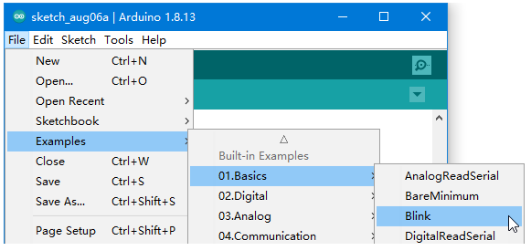
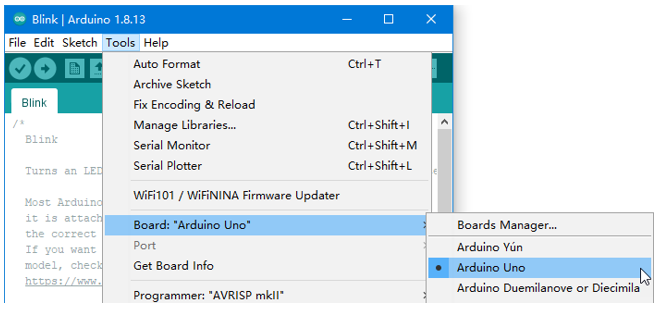
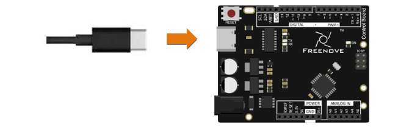
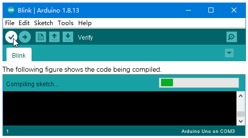
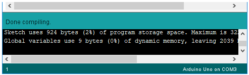
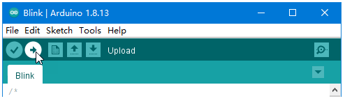
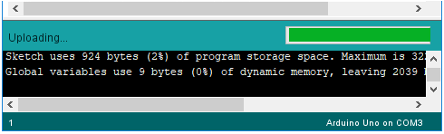
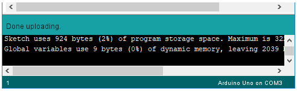
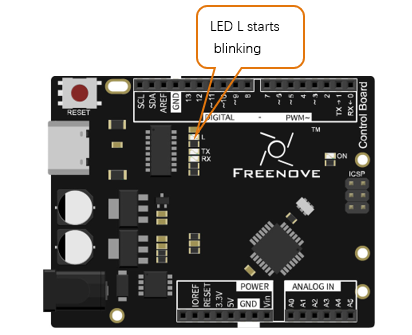
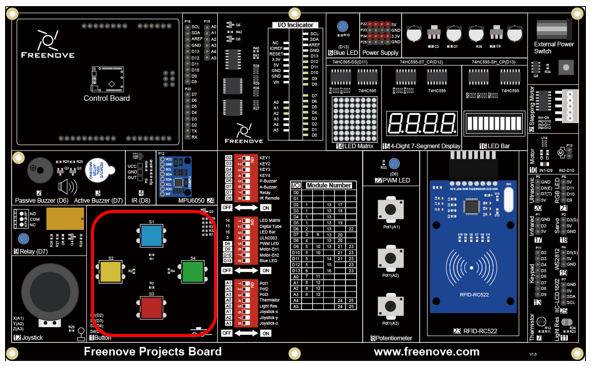

##############################################################################
First Use
##############################################################################

Open the example sketch "Blink".

Select board "Arduino Uno". (Freenove control board is compatible with this board.)

Connect control board to your computer with USB cable.

Select the port.

.. note::
    
    Your port may be different from the following figure.

    On Windows: It may be COM4, COM5 (Arduino Uno) or something like that.

    On Mac: It may be /dev/cu.usbserial-710, /dev/cu.usemodem7101 (Arduino Uno) or something like that.

    On Linux: It may be /dev/ttyUSB0, /dev/ttyACM0 or something like that.

.. note::
    
    If there is more than one port and you cannot decide which one to choose, disconnect the USB cable and check the port. Then connect the USB cable and check the port again. The new one is the correct port.

    If there is no COM port for control board, you may need to install a driver to your conputer.
    
    - For blue board, reinstall the latest version of Arduino IDE. During installation, agree to install the driver.
    
    - For black board, see “InstallDriver.pdf” in “Drivers” folder (in the folder contains this Tutorial.pdf).

    :red:`Having problems? Contact us for help!` Send mail to: support@freenove.com

Click "Verify" button.

Wait a moment for the compiling to be completed. Figure below shows the code size and percentage of space occupation. If there is an error in the code, the compilation will fail and the details are shown here.

Click "Upload" button.

Figure below shows code uploading. 

Wait a moment, and then the uploading is completed.

.. hint::
    
    :red:`Having problems? Contact us for help!` Send mail to: support@freenove.com

After that, we will see the LED marked with "L" on the control board start blinking. It indicates that the code is running now!

So far, we have completed the first use. I believe you have felt the joy of it. Next, we will carry out a series of projects, from easy to difficult, to help you learn programming.

Before use, you can install the button cap in the material package on the board.

