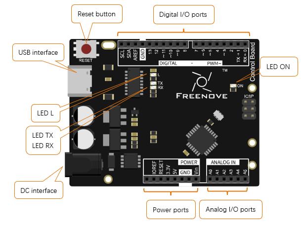

##############################################################################
Preface
##############################################################################

If you want to make some interesting projects or want to learn electronics and programming, this document will greatly help you.

Projects in this document usually contains two parts: the circuit and the code. No experience at all? Don't worry, this document will show you how to start from scratch.

If you encounter any problems, please feel free to send us an email, we will try our best to help you.

Support email: support@freenove.com

To complete these projects, you need to use a control board and software to program it, as well as some commonly used components.

Control Board
******************************************************************************

The control board is the core of a circuit. After programming, it can be used to control other components in the circuit to achieve intended functions.

There are multiple versions of Freenove control board. Your purchase may be one of the following:

.. list-table:: 
    :width: 80%
    :align: center
    :class: product-table

    *   -   Freenove Control Board (Black)
        -   Freenove Control Board (Blue)
    *   -   |Preface00|
        -   |Preface01|

.. note::
    
    Although the colors and shapes of these control boards are somewhat different, their ports and functions are the same. They can be replaced with each other, and there is no difference in their usages.

.. note::
    
    Only the black control board is used to display the hardware connection in this document. The hardware connection of the blue control board is the same.

Diagram of the Freenove control board is shown below:

- Digital I/O ports is used to connect to other components or modules, to receive an input signal, or to send a control signal. Usually, we name it by adding a "D" in front of the number, such as D13 (pin 13).
- USB interface is used to provide power, upload code or communicate with PC. 
- LED L is connected to digital I/O port 13 (pin 13).
- LED TX, RX is used to indicate the state of the serial communication. 
- DC interface is connected DC power to provide power for the board.
- Power ports can provide power for electronic components and modules.
- Analog I/O ports can be used to measure analog signals. 
- LED ON is used to indicate the power state.

Projects Board
******************************************************************************

Features

Assemble Acrylic Part

1. Peel off the sticker on the acrylic surface. If you don't think it is necessary, you can leave it alone.

2. Take out 8 of the them. We have prepared 2 more for you to avoid losing screws during assembly.

3. Fix 8 Brass Standoff and 8 Round Head Nut with the acrylic. 
   

4.	Use 8 Screws to fix the motherboard with the acrylic. There are 8 holes on the motherboard, corresponding to the 8 Brass Standoff on the acrylic.

.. warning::
    
    If it cannot be installed, please rotate the acrylic 180 degrees, or check whether the Brass Standoff and Round Head Nut are installed reversely.

Finish

Programming Software
******************************************************************************

We use Arduino® IDE to write and upload code for the control board, which is a free and open source.

(Arduino® is a trademark of Arduino LLC.)

Arduino IDE uses C/C++ programming language. Don't worry even if you have never used it, because this document contains programming knowledge and detailed explanation of the code.

First, install Arduino IDE. Visit https://www.arduino.cc/en/Main/Software. Select and download a corresponding installer according to your operating system. If you are a windows user, please select the "Windows Installer".

After the downloading completes, run the installer. For Windows users, there may pop up an installation dialog box of driver during the installation process. When it is popped up, please allow the installation.

After installation is completed, an shortcut will be generated in the desktop.

Run it. The interface of the software is as follows:

Programs written with Arduino IDE are called sketches. These sketches are written in a text editor and are saved with the file extension.ino. The editor has features for cutting/pasting and for searching/replacing text. The message area gives feedback while saving and exporting and also displays errors. The console displays text output by the Arduino IDE, including complete error messages and other information. The bottom right-hand corner of the window displays the configured board and serial port. The toolbar buttons allow you to verify and upload programs, create, open, and save sketches, and open the serial monitor.

Additional commands are found within five menus: File, Edit, Sketch, Tools, Help. The menus are context sensitive, which means only those items relevant to the work currently being carried out are available.