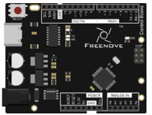
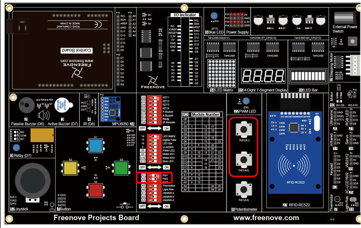

##############################################################################
Chapter Voltmeter
##############################################################################

In this chapter, we will use the control board and Processing to make a simple voltmeter to understand the mutual communication between them.

Project 1.1 Voltmeter
************************************

First, make a simple voltmeter.

Component list
======================================

+-------------------------+----------------+
| Control board x1        | USB cable x1   |
|                         |                |
| |Chapter01_00|          | |Chapter01_01| |
+-------------------------+----------------+
| Freenove Projects Board                  |
|                                          |
| |Chapter01_02|                           |
+------------------------------------------+

.. |Chapter01_01| image:: ../_static/imgs/1_LED_Blink/Chapter01_01.png
.. |Chapter01_02| image:: ../_static/imgs/1_LED_Blink/Chapter01_02.png

Circuit
=============================

Use pin A1 on the control board to detect the voltage of rotary potentiometer.

+-------------------------+-----------------------------------------------------------+
| Schematic diagram       | Hardware connection                                       |
|                         |                                                           |
| |Chapter01_00p|         | |Chapter01_01p|                                           |
+-------------------------+-----------------------------------------------------------+
| Hardware connection                                                                 |
|                                                                                     |
| Insert the Control Board to Freenove Projects Board, and then turn the corresponding|
|                                                                                     |
| switch to the right(ON).                                                            |
|                                                                                     |
| |Chapter01_02p|                                                                     |
+-------------------------------------------------------------------------------------+

.. |Chapter01_01p| image:: ../_static/imgs/1_Voltmeter/Chapter01_01.png

Communication protocol
=================================

We need to write code for control board and Processing to complete the interaction project of them, respectively.

In order to simplify and facilitate the operation, we prepared a SerialDevice class for Processing to communicate with the control board. To use this class, we need to upload the following sketch to the control board:

Processing\ControlBoard\SerialDevice\SerialDevice.ino.

This sketch only need to be uploaded once, so the latter projects of this tutorial does not need to upload again.

SerialDevice class and SerialDevice.ino defined the communication protocol between them. The futures include:

- Recognize the control board uploaded SerialDevice.ino and establish connection with it, automatically. No need to view and set the serial number of the control board connected to the computer, even if there are a number of control board, it can be connected automatically.
- If control board uploaded SerialDevice.ino is not connected to computer, the Processing code will not be executed until the connection is done. The Processing sketch does not need to be run again after the connection is done.
- Send data to control board and receive data from it.

Sketch
=====================================

Before running Processing sketch, make sure that SerialDevice.ino is uploaded to the control board.

Processing sketches is stored under the Processing\Processing folder.

Sketch Voltmeter
---------------------------------------

Use Processing to open Voltmeter.pde and click Run. Then, the following window will pop up and its connection to the control board will be started.

If the control board has not been connected to computer, please connect the control board to your computer. 

If the connection succeeds, the follow will be shown:

This sketch will obtain analog value from A1 port of control board, and convert it to voltage value to display. You can adujust the potentiometer to observe the change of value, and you can also use the A1 port to measure voltage value of other circuits. Note that the measurement voltage can not exceed 5V, which will do damage to the control board.

Here, Processing sketch code will not be introduced in detail. Interested readers can learn it by yourself.

And as for syntax and standard functions of Processing, you can visit https://processing.org/ and click Reference to view.

Or in the Processing software menu bar, click Help-Reference to view offline documents.

Project 1.2 Voltmeter Dual Channel

Now, let's make a dual channel voltmeter.

Component list
======================================

+-------------------------+----------------+
| Control board x1        | USB cable x1   |
|                         |                |
| |Chapter01_00|          | |Chapter01_01| |
+-------------------------+----------------+
| Freenove Projects Board                  |
|                                          |
| |Chapter01_02|                           |
+------------------------------------------+

Circuit
=============================

Use pin A1 on the control board to detect the voltage of rotary potentiometer.

+-------------------------+-----------------------------------------------------------+
| Schematic diagram       | Hardware connection                                       |
|                         |                                                           |
| |Chapter01_07p|         | |Chapter01_08p|                                           |
+-------------------------+-----------------------------------------------------------+
| Hardware connection                                                                 |
|                                                                                     |
| Insert the Control Board to Freenove Projects Board, and then turn the corresponding|
|                                                                                     |
| switch to the right(ON).                                                            |
|                                                                                     |
| |Chapter01_09p|                                                                     |
+-------------------------------------------------------------------------------------+

Sketch
=================================

Sketch Voltmeter_Dual_Channel
------------------------------------

Use Processing to open Voltmeter_Dual_Channel.pde and click Run. Then, the following window will pop up and its connection to control board will be started.

If the control board has not been connected to computer, please connect the control board to your computer. 

If the connection succeeds, the follow will be shown:

This sketch will obtain analog value from A1 and A2 ports of control board, and convert them to voltage value to display. You can adujust the potentiometers to observe the change of value, and you can also use the A1 and A2 ports to measure voltage value of other circuits. Note that the measurement voltage can not exceed 5V, which will do damage to the control board.

You can export the two Processing sketches in this chapter to the application as common tools.