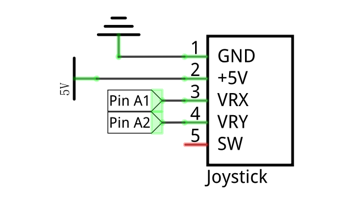
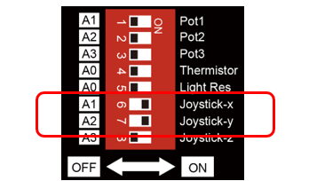
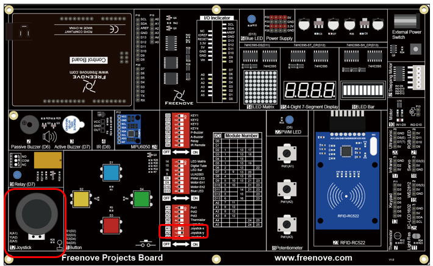
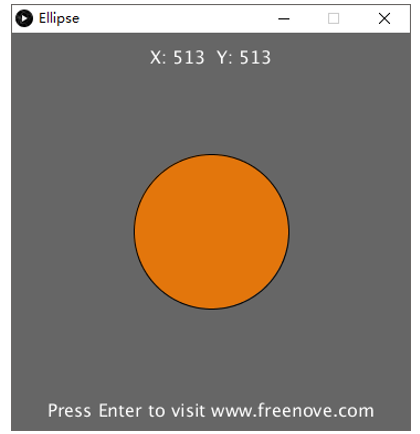
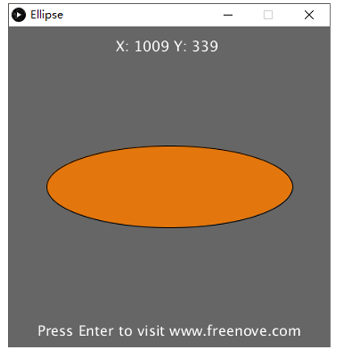
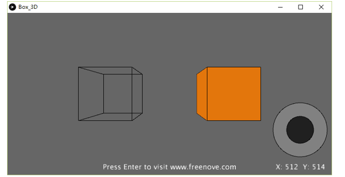
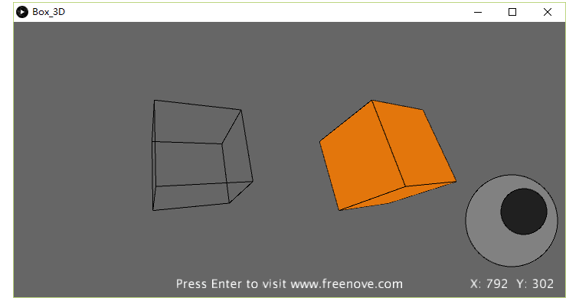

##############################################################################
Chapter Control 2D and 3D Figures
##############################################################################

In this chapter, we will use connect board to make Processing program display figure changes. And we will control 2D and 3D figures, respectively.

Project 3.1 Ellipse
**********************************

First, control a 2D figure.

Component list
======================================

+-------------------------+----------------+
| Control board x1        | USB cable x1   |
|                         |                |
| |Chapter01_00|          | |Chapter01_01| |
+-------------------------+----------------+
| Freenove Projects Board                  |
|                                          |
| |Chapter01_02|                           |
+------------------------------------------+

.. |Chapter01_00| image:: ../_static/imgs/1_LED_Blink/Chapter01_00.png
.. |Chapter01_01| image:: ../_static/imgs/1_LED_Blink/Chapter01_01.png
.. |Chapter01_02| image:: ../_static/imgs/1_LED_Blink/Chapter01_02.png

Circuit
======================================

Use A1 and A2 ports on connect board to detect the voltage value of two rotary potentiometers inside joystick.

+-------------------------+-----------------------------------------------------------+
| Schematic diagram       | Hardware connection                                       |
|                         |                                                           |
| |Chapter03_00|          | |Chapter03_01|                                            |
+-------------------------+-----------------------------------------------------------+
| Hardware connection                                                                 |
|                                                                                     |
| |Chapter03_02|                                                                      |
+-------------------------------------------------------------------------------------+

    
Sketch
==================================

Sketch Ellipse
-----------------------------------

Use Processing to open Ellipse.pde, then click Run. If the connection succeeds, the following will be shown:

Then you can change the ellipse shape by shifting the joystick:

Project 3.2 Box 3D
*************************************

Now control 3D figures.

Component list & Circuit
====================================

The same as last section.

Sketch
===================================

Sketch Box_3D
-----------------------------------

Use Processing to open Box_3D.pde, and click Run. If the connection succeeds, the following will be shown. The left is a 3D box presented by line and the right is a 3D box entity.

Then you can change the space angle of two 3D box by shifting the joystick:

