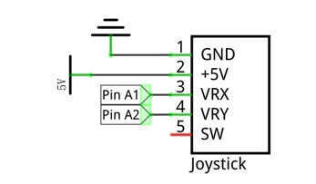
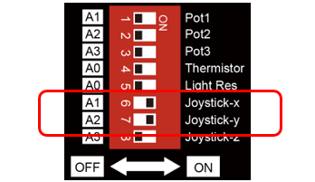
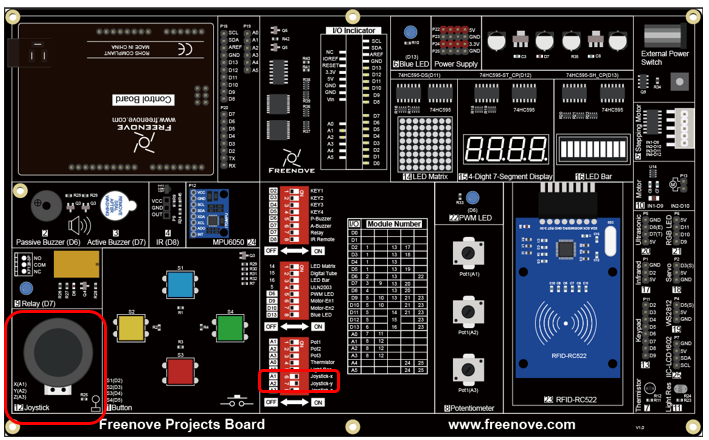
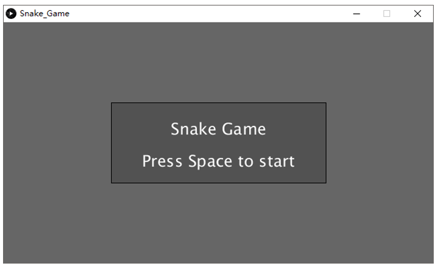
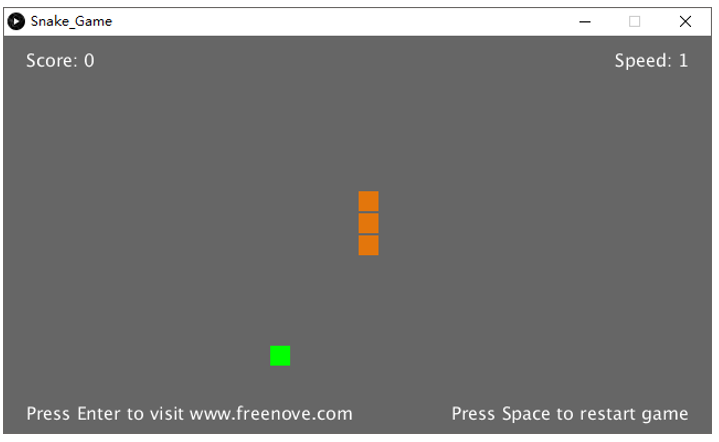
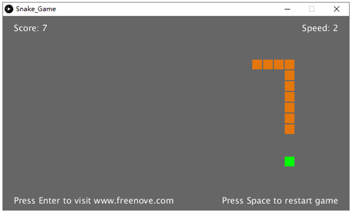
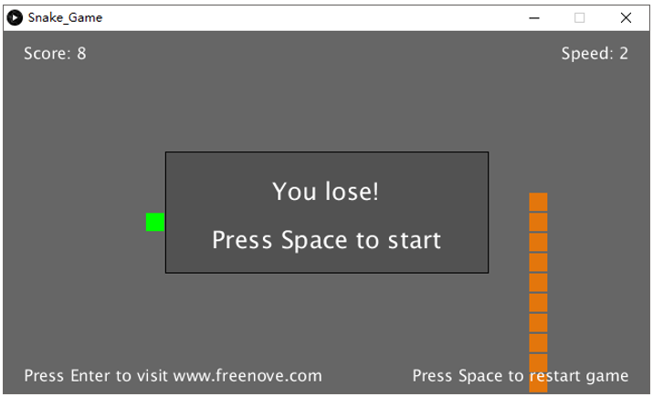
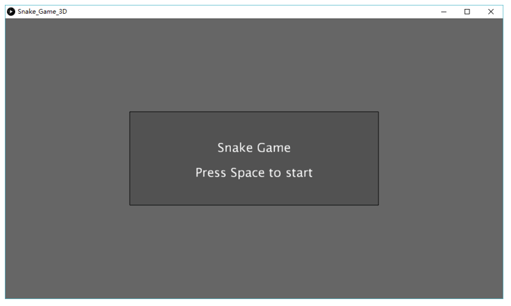
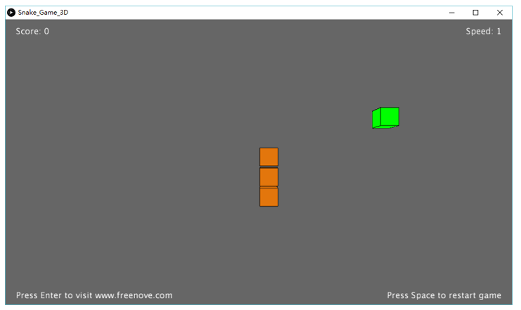
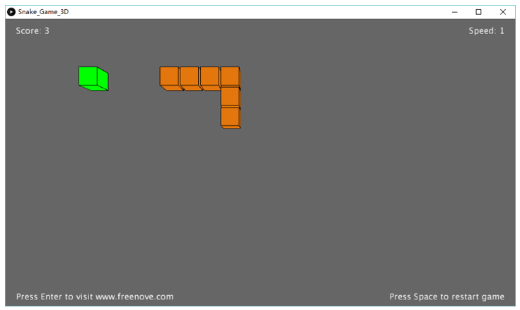

##############################################################################
Chapter Snake Game
##############################################################################

We have experienced controlling 2D and 3D figures before. Now, we use connect board to play the classic snake game. You will experience both 2D and 3D version.

Project 4.1 Snake Game
***************************************

First, let's experience the 2D version game.

Component list
======================================

+-------------------------+----------------+
| Control board x1        | USB cable x1   |
|                         |                |
| |Chapter01_00|          | |Chapter01_01| |
+-------------------------+----------------+
| Freenove Projects Board                  |
|                                          |
| |Chapter01_02|                           |
+------------------------------------------+

.. |Chapter01_00| image:: ../_static/imgs/1_LED_Blink/Chapter01_00.png
.. |Chapter01_01| image:: ../_static/imgs/1_LED_Blink/Chapter01_01.png
.. |Chapter01_02| image:: ../_static/imgs/1_LED_Blink/Chapter01_02.png

Circuit
=========================================

Use A1 and A2 ports on connect board to detect the voltage value of two rotary potentiometers inside joystick.

+-------------------------+-----------------------------------------------------------+
| Schematic diagram       | Hardware connection                                       |
|                         |                                                           |
| |Chapter04_00|          | |Chapter04_01|                                            |
+-------------------------+-----------------------------------------------------------+
| Hardware connection                                                                 |
|                                                                                     |
| |Chapter04_02|                                                                      |
+-------------------------------------------------------------------------------------+

Sketch
======================================

Sketch Snake_Game
----------------------------------------

Use Processing to open Snake_Game.pde and click Run. If the connection succeeds, the follow will be shown:

Press the space bar on keyboard to start the game:

Shift the joystick to control the snake action. The game rules are the same as the classic snake game:

When the game fails, press space bar to restart the game:

Additionally, you can restart the game by pressing the space bar at any time.

Project 4.2 Snake Game 3D
************************************************

Now, let's experience the 3D version game.

Component list
==================================

The same as last section.

Circuit
====================================

The same as last section.

Sketch
=====================================

Sketch Snake_Game_3D
---------------------------------------

Use Processing to open Snake_Game_3D.pde and click Run. If the connection succeeds, the follow will be shown:

Press the space bar on keyboard to start the game:

Shift the joystick to control the snake action. The game rules are the same as the classic snake game:

The rest operation is the same as the 2D version.