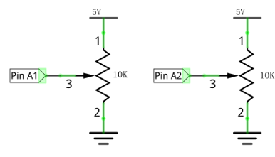
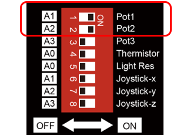
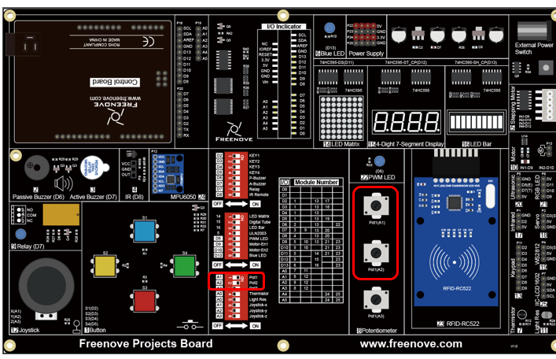
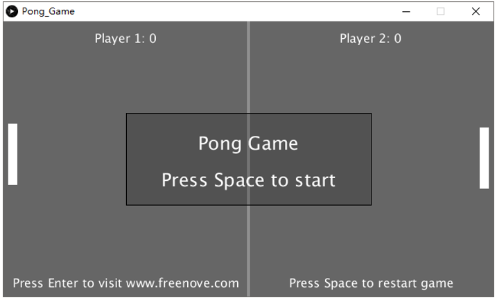
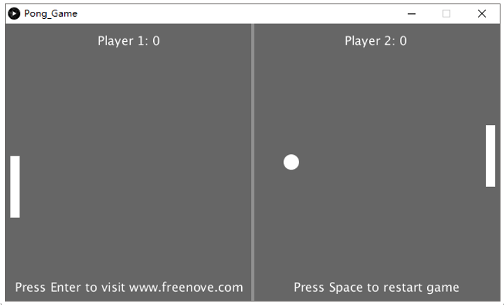
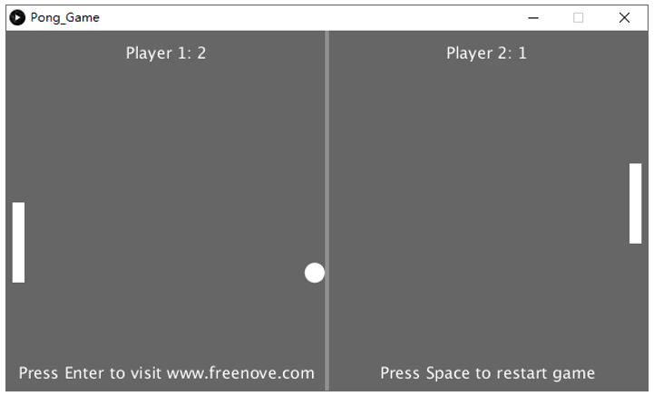
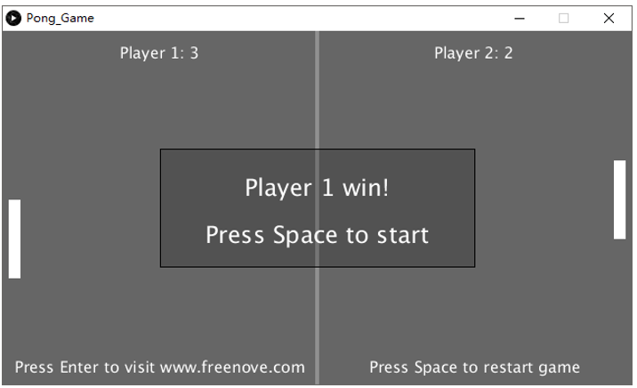
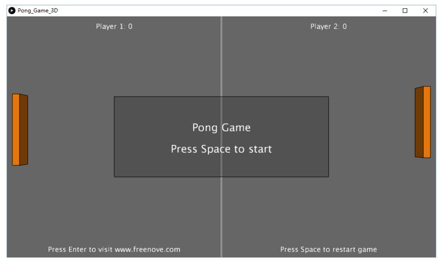
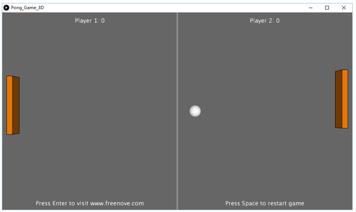
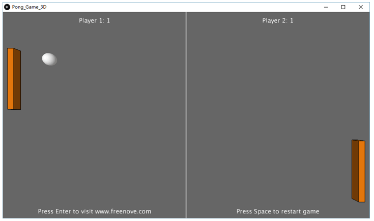

##############################################################################
Chapter Pong Game
##############################################################################

We have experienced single-player game snake before. Now, let's use connect board to play classic two-player pong game. You will experience both 2D and 3D version.

Project 5.1 Pong Game
****************************************

First, let's experience the 2D version game.

Component list
======================================

+-------------------------+----------------+
| Control board x1        | USB cable x1   |
|                         |                |
| |Chapter01_00|          | |Chapter01_01| |
+-------------------------+----------------+
| Freenove Projects Board                  |
|                                          |
| |Chapter01_02|                           |
+------------------------------------------+

.. |Chapter01_00| image:: ../_static/imgs/1_LED_Blink/Chapter01_00.png
.. |Chapter01_01| image:: ../_static/imgs/1_LED_Blink/Chapter01_01.png
.. |Chapter01_02| image:: ../_static/imgs/1_LED_Blink/Chapter01_02.png

Circuit
=========================================

Use A1 and A2 ports on connect board to detect the voltage value of two rotary potentiometers inside joystick.

+-------------------------+-----------------------------------------------------------+
| Schematic diagram       | Hardware connection                                       |
|                         |                                                           |
| |Chapter05_00|          | |Chapter05_01|                                            |
+-------------------------+-----------------------------------------------------------+
| Hardware connection                                                                 |
|                                                                                     |
| Insert the Control Board to Freenove Projects Board, and then turn the corresponding|
|                                                                                     |
| switch to the right(ON).                                                            |
|                                                                                     |
| |Chapter05_02|                                                                      |
+-------------------------------------------------------------------------------------+

Sketch
=====================================

Sketch Pong_Game
-------------------------------------

Use Processing to open Pong_Game and click Run. If the connection succeeds, the follow will be shown:

Now you can try to turn the potentiometer to control the movement of paddle without ball. Press space bar to start the game: 

Use potentiometer to control the movement of paddle to block the ball back. The game rules are the same as classic pong game:

The game will be over when one side reachs three points. Pressing the space bar can restart the game:

Additionally, you can restart the game by pressing the space bar at any time.

Project 5.2 Pong Game 3D
****************************************

Now, let's experience the 3D version game.

Component list
========================================

The same as last section.

Circuit
========================================

The same as last section.

Sketch
========================================

Sketch Pong_Game_3D
----------------------------------------

Use Processing to open Pong_Game_3D.pde and click Run. If the connection succeeds, the follow will be shown:

Now you can try to turn the potentiometer to control the movement of paddle without ball. Press space bar to start the game: 

Use potentiometer to control the movement of paddle to block the ball back. The game rules are the same as classic pong game:

The rest operation is the same as the 2D version.